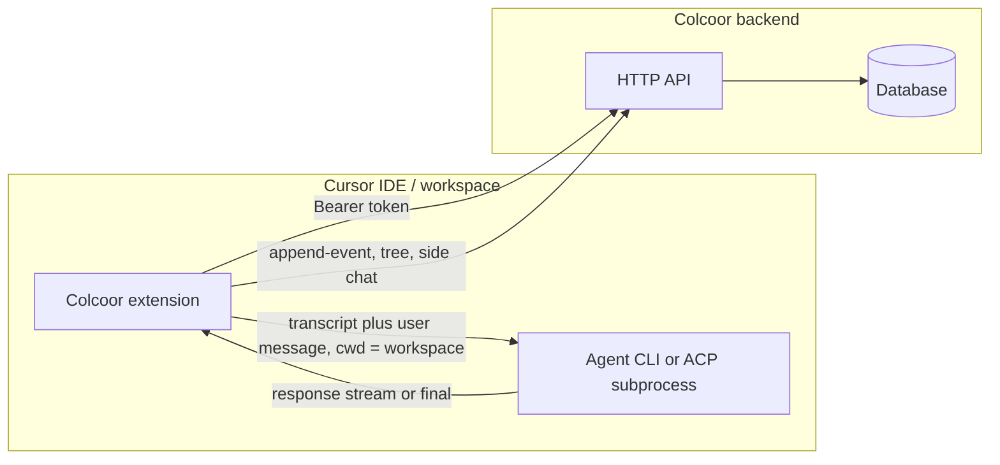

# Architecture — Colcoor Cursor extension

See **[principles.md](principles.md)** for the split between **Colcoor** (transcript + structure + persistence) and **Cursor** (execution + optional augmented code context).

## 1. Goal

Ship a **Cursor extension** plus **Colcoor backend** so users manage **branching conversations** with the **Cursor agent** on the main thread. The backend stores the **event graph**, **notes**, **side chat**, **membership**, and **billing**; it does **not** run the main-thread LLM. See **[domain-model.md](domain-model.md)** for semantics.

## 2. Backend role

The Colcoor backend is the **source of truth** for:

- Event graph (`user_input` / `assistant_output`)
- Conversation metadata and membership
- Notes
- Side chat
- Permissions
- Billing and usage ([monetization.md](monetization.md), [billing-usage.md](billing-usage.md))

The backend **does not**:

- Run the **main-thread** LLM (that is Cursor)
- Build or serve **execution transcripts** for the agent ([principles.md](principles.md))

## 3. System components

- **Extension** — Builds the **authoritative** transcript; calls **`append-event`**; runs the agent via **CLI / ACP** when available ([data-flow-and-api.md](data-flow-and-api.md)); updates UI from API responses. **Conversation tree** UI contract (selection vs actions, multi-layout readiness): [tree-ui-contract.md](tree-ui-contract.md).
- **Cursor agent runtime** — Subprocess or supported API; may add files/symbols internally; Colcoor does not duplicate that layer.
- **Colcoor backend** — HTTP API and database ([database.md](database.md), [api-contracts.md](api-contracts.md)); **append-event** and related routes; no server-side main-thread streaming completion.

## 4. Agent integration (extension responsibilities)

1. Construct the transcript **deterministically** ([domain-model.md](domain-model.md), [transcript-format.md](transcript-format.md)).
2. Provide the **user message** for the turn.
3. **Trigger** the agent (prefer programmatic CLI/ACP; Composer-style fallback if needed).
4. **Persist** results with **`append-event`** and other Colcoor APIs.

Prefer **stable programmatic** integration over fragile UI automation.

## 5. Independence

This **documentation set** defines the Colcoor extension product **on its own**. Implementation may live in any repository layout; these files do not depend on another product’s codebase or documentation.

## 6. Main-thread boundary

- No server-side main-thread streaming completion API; use **`append-event`** + Cursor agent ([data-flow-and-api.md](data-flow-and-api.md)).
- **Server-side web search and code execution** as Colcoor-driven main-thread tools are **out of scope** for this product.

## 7. Side chat

Persisted and loaded **only** through the Colcoor backend; realtime via **SSE** (see [domain-model.md](domain-model.md) §6). Not routed through the Cursor main-thread agent for persistence.

## 8. Git and workspace

Optional hints to the agent (active file, selection, diff): [principles.md](principles.md). Git metadata vs tree: [git-integration.md](git-integration.md).

## 9. Non-goals (MVP)

- **MCP** and **cloud agents** — [principles.md](principles.md).
- Replacing Cursor’s file/symbol intelligence.
