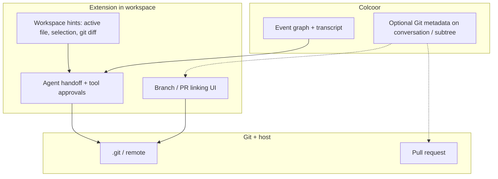

# Git integration — Colcoor in a Git workspace

This document specifies how **Git version control** relates to **Colcoor conversations** in a Cursor workspace. It is **product guidance** for implementers and reviewers; exact APIs and UI copy may evolve.

**Related:** [principles.md](../principles.md) (authoritative transcript vs Cursor-augmented context), [architecture.md](../product/architecture.md) §8, [domain-model.md](../product/domain-model.md) (event graph), [tree-ui-contract.md](../product/tree-ui-contract.md) (tree is navigation, not Git), [data-flow-and-api.md](../product/data-flow-and-api.md) (turn order), [ui-features.md](../product/ui-features.md) (checkpoint labels, details panel / detail bar).

---

## 1. Summary

Colcoor conversations and Git solve **different problems**:

| Layer | What it tracks | Source of truth |
|-------|----------------|-----------------|
| **Colcoor event graph** | Reasoning structure — who said what, where the dialogue branches, notes, private drafts | Colcoor backend (`events`, `notes`, …) |
| **Git** | Code changes — files, commits, branches, merges, pull requests | Local `.git` + remote host (GitHub, etc.) |

They are **loosely coupled**. Git **does not** synchronize or replicate the conversation graph. The conversation graph **does not** replace Git for code history.

The integration goal is **convenience**: while you reason in a branching conversation, Colcoor should make it **easy to see code state** (especially in the **details panel** for the **active code line**, §5.5, §7), **keep code aligned with the event graph** (default **strict** mode, §6.6), show **how each code line relates to its parent code line** (§5.6), support **update from parent** and **merge into parent** as explicit workflows (§6.6.4), handle **unresolved workspace changes** before workspace alignment or code-affecting actions (§5.9, §6.6.5), **link work to branches/PRs when useful**, and **let the Cursor agent run Git commands safely** — without confusing conversation branches with Git branches or turning Git operations into conversation nodes (§5.8).

---

## 2. Design principles

### 2.1 Loose coupling (hard rule)

- Conversation structure and Git are **independent domains**.
- Git operations **must not** silently rewrite, migrate, or delete conversation nodes.
- Conversation operations **must not** imply a Git commit, merge, or push unless the user (or an explicit, approved agent action) performs it.
- **No** “one conversation node = one Git commit” invariant in the **default** (passive) workflow.
- In **strict code-sync** conversations (§6.6), each code-changing event **does** imply one Git commit and one dedicated Git branch (a **code line**) — by **conversation policy**, not per-turn user choice. **Parent code line** ancestry and **relationship state** are defined on code lines only (§5.5–§5.6), not on arbitrary conversation nodes. **Update/merge** workflows and **unresolved workspace** rules are separate from the event graph (§5.8–§5.9, §6.6.4). **Strict is the default** for Git-backed conversations (§6.6.6); `passive` is opt-out (§5.3.1).

### 2.2 Colcoor controls reasoning; Cursor controls execution

- **Transcript** (path root → active node + notes) is built and owned by the extension ([principles.md](../principles.md)).
- **Git read/write in the workspace** is executed by the **Cursor agent** (shell / IDE integration), not by the Colcoor backend.
- The backend **may** store **metadata pointers** (branch name, PR URL); it **must not** run `git` against the user’s machine.

### 2.3 User-native UX

Users should not need to understand transcript plumbing or metadata schemas. In a normal Git repo, **strict** code-sync (§6.6) runs automatically; **passive** Git and manual branch linking are **opt-out**.

- Prefer **Git status, synchronization state, and code-line actions in the details panel** (detail bar and related context panes for the active node) — **not** in the conversation transcript ([tree-ui-contract.md](../product/tree-ui-contract.md) §2, §7).
- Prefer **clear labels** (“Git branch”, “Checkpoint title”) over overloading one word (“branch”, “commit”) for both domains.
- In **strict** workflows, **tree selection** is **read-only** for Git (§6.6.5): browsing updates the details panel but **does not** switch the workspace. Colcoor **aligns** the workspace to the selected node’s **active code line** only **before** code-affecting or context-executing actions (or on an explicit **align workspace** action), applying §5.9 first — **no** checkout or dirty-workspace prompts on mere clicks.

### 2.4 Determinism where Colcoor owns it

Given the same event graph path and notes, transcript construction is deterministic ([principles.md](../principles.md)). Git **working tree** state is **environment-dependent** and may change between turns; treat it as **hint context**, not as persisted conversation state.

### 2.5 Workspace Git execution serialization

Colcoor **must serialize** all operations that **read–modify–write** the **local** workspace Git context, or that **depend on a stable Git state** while they run. Concurrent overlap (e.g. alignment during an in-flight strict commit+push, or two agent runs both checking out different code lines) can corrupt the working tree, leave metadata inconsistent with `.git`, or violate §5.9.

**Lock scope (normative):** the **workspace Git execution context** — typically one **linked repo** (`git.repo_root` / `repo_id`) and the **workspace code line** Colcoor is operating on for that machine. Exact granularity (per repo root vs per worktree) is **implementation-defined**, but the lock **must not** span the **conversation graph**.

| In scope for serialization | Out of scope (may proceed concurrently) |
|----------------------------|----------------------------------------|
| Workspace **alignment** (§6.6.5) | Loading or patching the **event graph** on the backend |
| Strict **commit + push** pipeline (§6.6.2) | Tree **selection** and details-panel **display** updates |
| **Update from parent** / **merge into parent** (§6.6.4) | Refreshing **repository metadata** for display (§5.7) when read-only |
| Resolving **unresolved workspace changes** (§5.9) before alignment | Sending **non-code** messages that do not trigger alignment |
| Agent or extension steps that run **write** Git commands or assume a fixed checkout | Multiple users on **different machines** (each has its own local lock) |

**Product expectation:** At most one workspace Git **execution** runs at a time per execution context on a given machine. Additional requests **queue** or **fail fast** with clear copy (e.g. *“Git operation in progress”*) — implementation-defined, but **must not** interleave read–modify–write steps.

The backend **does not** hold this lock; it applies only where Git runs (extension / agent in the workspace, §2.2).

---

## 3. Two “branch” concepts (do not conflate)

Developers already use “branch” for Git. Colcoor uses “branch” for **conversation forks** in the event graph ([domain-model.md](../product/domain-model.md) §3).

| Term in UI/docs | Meaning |
|-----------------|--------|
| **Conversation branch** | A fork in the **`events`** tree (`user_input` / `assistant_output` siblings or children). Navigation via tree selection and `active_event_id`. |
| **Git branch** | A ref in `.git` (`main`, `feature/foo`, …). Manipulated with Git CLI / IDE / host UI. |
| **Private draft branch** | Colcoor visibility (`visible_to` set) — **not** a Git concept ([permissions.md](../product/permissions.md)). |
| **Working branch** (this doc) | Optional **metadata** field naming a Git branch associated with a conversation region (§5) — primarily **passive** mode (§5.3.1). |
| **Code line** | Git snapshot tied to a **code-changing** event (§5.5) — primary unit in **strict** mode. |
| **Parent code line** | Nearest **code-changing ancestor’s** line on the active path (§5.5.2) — **not** the conversation graph’s parent node. |
| **Active code line** | Nearest code-changing ancestor of the **selected** node; drives Git UI (§5.5.3). |

**Rule:** UI copy, tooltips, and agent system hints **must** disambiguate when both could appear (e.g. “Continue conversation from here” vs “Checkout Git branch `feature/foo`”; “parent code line” vs “parent event”).

---

## 4. Integration layers

Git touches Colcoor at three layers. They compose but can ship independently.



### 4.1 Layer A — Workspace hints (shipped baseline)

**Purpose:** Give the agent a snapshot of editor + working tree without Colcoor persisting Git state.

**Behavior (reference implementation):**

- When `colcoor.includeWorkspaceHintsInAgentPrompt` is enabled (default **on**), the extension **may** append a block after the authoritative transcript:
  - Active file path (relative to workspace root)
  - Selected text (truncated)
  - `git diff --no-color --unified=0` output (truncated)
- Format: see `workspaceContextAppendix.ts` and [principles.md](../principles.md) § “Workspace integration”.
- This block is **CLI-only appendix** — it is **not** part of the persisted event graph and **not** replayed from the backend on another machine.

**Invariants:**

- Hints are **best-effort** (no repo, dirty state, or command failure → omit diff; do not fail the turn).
- When workspace classification is **`git_mismatch`** (§6.7), **omit** `git diff` from Layer A unless product explicitly labels it as *current workspace, not linked repo* — prefer omit for agent safety.
- Hints **must not** replace Cursor’s own code retrieval ([principles.md](../principles.md)).
- Changing Git state **does not** set `needs_context_rebuild` ([domain-model.md](../product/domain-model.md) §4); only graph/note/selection changes do.

### 4.2 Layer B — Workflow metadata (optional, product-defined)

**Purpose:** Attach **durable, shareable pointers** from a conversation (or a **subtree**) to Git workflow objects — branch names, PR ids, repo identity — for navigation and collaboration.

**Storage (recommended):**

- **Conversation-level:** `conversations.metadata_json` ([api-contracts.md](../product/api-contracts.md) §3) — defaults for the whole conversation (default remote, base branch, linked repo root).
- **Subtree-level:** optional JSON on events or a dedicated metadata map keyed by `event_id` (implementation choice). Semantics below (§5) are stable even if the physical schema varies.

**Invariants:**

- Metadata is **annotation**, not source of truth for code or for the event graph.
- Stale metadata (branch deleted, PR merged) **must** degrade gracefully (show “last known”, offer refresh).
- Viewers **may** read metadata; **editors/owners** **may** write it ([permissions.md](../product/permissions.md)).

### 4.3 Layer C — Agent Git operations (via Cursor)

**Purpose:** User asks in natural language to commit, push, open PR, etc.; the **Cursor agent** runs shell / host CLI tools.

**Colcoor’s role:**

- Include Layer A hints on each run when enabled.
- Surface **tool approval** for destructive or broad Git commands (existing shell approval path in the extension).
- In **default** mode: **do not** auto-commit on every assistant message or every conversation branch.
- In **strict code-sync** mode (§6.6): the extension **must** run an automated commit (+ push) pipeline after each code-changing turn; merges remain **explicit user** actions (§6.6.4).

**User rules** in Cursor (e.g. “only commit when I ask”) apply to **passive** conversations only. Strict mode overrides that for participants who joined a conversation created with `git_sync_mode: strict` and appropriate permissions.

---

## 5. Metadata semantics (optional)

Exact JSON keys and PATCH routes are **implementation-defined**. This section fixes **meaning** so conversation and Git stay loosely coupled.

### 5.1 Conversation-level fields (`metadata_json`)

| Field | Type | Meaning |
|-------|------|---------|
| `git.repo_root` | string | Absolute or workspace-relative path to the Git root this conversation primarily tracks. Default: first workspace folder with `.git`. May be stale across machines; use `git.repo_id` for match (§6.7.1). |
| `git.repo_id` | string | Stable repo identity for open/mismatch detection (e.g. hash of `origin` URL, or `host/owner/repo`). |
| `git.remote_name` | string | e.g. `origin`. Default: `origin`. |
| `git.default_base_branch` | string | e.g. `main`. Used when creating working branches. |
| `git.host` | string | Optional hint: `github`, `gitlab`, `azure`, `other`. For PR URL templates. |
| `git_sync_mode` | string | `strict` (default when workspace has Git at **create**), `passive` (§6.6.1). |
| `git_sync_paused_reason` | string | Optional, extension-written when strict cannot run: `no_repo`, `repo_mismatch`, `unverified`. Cleared when environment returns to `git_ok`. |
| `strict_effective_from_event_id` | string | Boundary for passive→strict or re-link (§6.6.6, §6.7.5). |

### 5.2 Subtree / region fields

A **Git-linked region** is a contiguous part of the conversation tree the team treats as one code effort (often anchored at a `user_input` with a **checkpoint label** or explicit “Start Git branch here” action).

| Field | Meaning (example) |
|-------|-------------------|
| `repo_id` | Stable id for the repo (path hash, host `owner/repo`, or uuid). |
| `base_branch` | Branch the region started from (e.g. `main`). |
| `working_branch` | Branch where edits for this region are expected (e.g. `colcoor/conv-abc-auth-refactor`). |
| `base_commit` | Optional SHA at region start (for “diff since we started this thread”). |
| `pr_id` / `pr_url` | Host pull request reference when opened. |
| `sync_state` | Optional enum: `active`, `merged`, `abandoned` — **display only**, refreshed from host or `git` locally. |

### 5.3 Relationship to the tree

- **Not** every tree node maps to a Git branch or code line.
- A **subtree** **may** map to one working branch in **passive** workflows (product-defined linking).
- **Multiple** conversation nodes **can** share the same `working_branch` in **passive** mode only (§5.3.1).
- **One** node **must not** imply exclusive ownership of a branch unless the UI says so — in passive mode, siblings may continue on the same Git branch by convention.

#### 5.3.1 Git branch ownership: passive vs strict

Passive and strict modes differ in **who owns Git refs** and **how tightly** conversation navigation maps to code. Do **not** apply passive assumptions (shared `working_branch`, loose 1:N node-to-branch mapping) to **strict** workflows.

| | **Passive** (`git_sync_mode: passive`) | **Strict** (`git_sync_mode: strict`, default) |
|--|----------------------------------------|-----------------------------------------------|
| **Primary Git unit** | Optional **`working_branch`** (and similar subtree metadata) — a **region** or convention | **Code line** — one ref per **code-changing** event (§5.5, §6.6.2) |
| **Node ↔ branch** | **Loose:** many conversation nodes may reference or imply the same `working_branch` | **Isolated:** each code-changing event gets its own code line; non-code nodes have **no** new code line |
| **Ownership** | Git ownership is **intentionally loose**; user/agent commits when they choose | Synchronization unit is the **per-event branch**; relationship state is computed **between code lines** (§5.6) |
| **Parallel conversation forks with code** | Unsafe without discipline — shared ref races (§6.4) | Each fork’s code-changing events get distinct code lines |
| **Details panel** | May show `working_branch`, optional coarse ahead/behind | Shows **selected** active code line, **workspace vs selection** when they differ (§5.5.4), relationship state (§5.6), update/merge availability |

### 5.4 Checkpoint labels vs Git commits

[ui-features.md](../product/ui-features.md) defines **checkpoint labels** (`events.checkpoint_label`): **display-only** titles in breadcrumb/tree/search.

| | Checkpoint label | Git commit |
|--|------------------|------------|
| **Stored in** | `events.checkpoint_label` | `.git` object database |
| **Purpose** | Name a milestone in the **conversation** | Record a snapshot of **code** |
| **Created by** | User on send or “Add message title” | `git commit` (user or agent) |
| **Coupling** | **None required** | Optional product action “Tag checkpoint at current HEAD” may link them in metadata (`checkpoint_event_id` → `commit_sha`) without merging the models |

### 5.5 Code lines, parent ancestry, and active resolution

**Lifecycle** (creation → development → integration / historical): §5.10.

**Code line** is the product term for the Git snapshot associated with a **code-changing** conversation event — typically a dedicated ref and `commit_sha` in strict mode (§6.6.2), or a linked `working_branch` region in passive mode (§5.3.1). Code lines are **not** conversation nodes; they are **metadata-backed code snapshots** tied to specific events.

**Terminology:** Use **parent code line** and **active code line** in Git UI and docs. Avoid **parent node** when describing Git ancestry — that phrase refers to **`parent_event_id`** in the event graph ([domain-model.md](../product/domain-model.md)) and is a different domain.

#### 5.5.1 Which events have a code line

- **Every code-changing event** belongs to exactly one code line (created when the turn is recognized as `code_touched`, per §6.6.2 in strict mode, or when the user/agent records code on a linked branch in passive mode).
- **Non-code events** (planning, Q&A, assistant text without workspace writes) **do not** create a new code line. They remain ordinary conversation events only.

#### 5.5.2 Parent code line (deterministic)

For any code line, the **parent code line** is derived **only** from **code-changing ancestry** on the **active conversation path** (root → selected node):

1. Walk from the code-changing event **up** the path toward the root.
2. The **parent code line** is the code line owned by the **nearest ancestor code-changing event** on that path.
3. If there is no ancestor code-changing event, the parent is the conversation’s **base** (e.g. `default_base_branch` / root `parent_commit_sha` — implementation-defined anchor, not a dialogue turn).

This rule is **deterministic** given the event graph path and `code_touched` flags. **Relationship-state** calculations (§5.6) — ahead, behind, diverged — compare **two code lines** (active vs parent code line), never a non-code chat event vs a code line.

#### 5.5.3 Active code line (for Git UI)

Git-related UI applies to the **active code line**, not necessarily to the **selected conversation event**.

**Active code line** = the code line owned by the **nearest code-changing ancestor** on the path from the root to the **currently selected** node.

**Example** (strict):

```text
code event A  →  chat B  →  chat C  →  code event D
```

- Selecting **A** or **D** → active code line is that event’s line.
- Selecting **B** or **C** → active code line is still **A’s** line (nearest code-changing ancestor). Git state, synchronization state, update/merge availability, and details-panel actions are evaluated for **A** until the user selects **D** (then active code line becomes **D**).

**Product expectation:** The details panel stays **consistent** whether the selected node changed code or not: it always describes the **active code line** (for the **selection**) and its **parent code line** relationship. Non-code selections do not show an empty or misleading Git panel.

#### 5.5.4 Selection vs workspace (strict)

In **strict** mode, **conversation selection** and **workspace Git state** are **decoupled**:

| | **Updates on tree selection** | **Updates on workspace alignment** |
|--|------------------------------|-------------------------------------|
| **Colcoor UI** (selection, transcript path, details panel for active code line) | **Yes** — lightweight; no Git commands | N/A (workspace already matches target line) |
| **Workspace** (checkout, working tree expected to match a code line) | **No** — browsing must not switch refs | **Yes** — before code-affecting work or explicit align (§6.6.5) |

The details panel **must** distinguish the **selected node’s active code line** from the **workspace code line** (the code line the working tree currently represents, if any). When they differ, show that the workspace is **not yet aligned** and that alignment will run before the next code-affecting action — e.g. *“Selected node code line differs from current workspace. Colcoor will align the workspace before the next code-affecting action.”*

Storage (cached pointers, walk at render time) is **implementation-defined**.

### 5.6 Relationship state between code lines

Colcoor exposes a **relationship state** between the **active code line** and its **parent code line** (§5.5.2) so users can see whether the line they are working from is synchronized with upstream code and what actions are available. Computation uses **only** those two code lines (and their recorded snapshots / refs), not intermediate chat events.

The exact storage (enum on event metadata, computed from Git, cached refresh) is **implementation-defined**; the **semantics** below are normative for product copy and affordances.

| State | User-visible meaning |
|-------|----------------------|
| **Up to date** | The active code line incorporates the parent code line’s history; no parent snapshots are waiting to be brought in, and the line has not diverged with unpromoted-only-on-child work (product may treat “same ancestry, child has no extra commits” as up to date). |
| **Behind parent** | The **parent code line** has snapshots **not** yet incorporated into the active code line. The user **may** run **update from parent** (§6.6.4). |
| **Ahead of parent** | The active code line has code not present on the parent code line (typical after a code-changing turn). **Merge into parent** (§6.6.4) may be appropriate when promoting work upstream. |
| **Diverged** | Both behind and ahead relative to the common ancestor of the two **code lines**. Resolution uses **update from parent**, **merge into parent**, or explicit conflict resolution — not conversation-graph edits. |
| **Merged** | The active code line’s changes have been **integrated into** the parent code line (or default base) in Git terms; conversation nodes remain for audit. A **terminal** synchronization outcome — metadata, not a new dialogue turn (§5.8). |
| **Conflict** | A **synchronization action** on this code line did not complete because overlapping changes need human decisions (§5.11). The conversation graph is unchanged; status and actions live in the details panel (§7). |

**Conflict** is distinct from **unresolved local workspace changes** (§5.9): §5.9 applies **before** starting integration; **Conflict** applies **after** a failed **update from parent** or **merge into parent** (or equivalent). A line may need both policies in sequence.

**Passive** workflows (§6.1) **may** show a subset of these states when subtree `working_branch` metadata exists; **strict** mode is where parent/active code-line semantics are first-class (§5.3.1). Lifecycle phases: §5.10.3.

### 5.7 What “update” means (user-facing)

Documentation and UI **must not** overload “update” or “sync.” Use distinct language for:

| Concept | Meaning | Default experience |
|---------|---------|----------------------|
| **Refresh repository information** | Re-read local or remote refs (branch list, PR status, ahead/behind) to refresh **metadata display**. Does **not** change the working tree or incorporate parent code. | Safe, frequent; “Sync Git metadata” (§7). |
| **Update from parent** | Bring **parent code line** changes **into** the **active** code line so this branch reflects upstream work. May produce **conflicts** (§5.6). First-class user workflow (§6.6.4). | Explicit user (or approved agent) action. |
| **Merge into parent** | Integrate **active** code line changes **into** the parent code line (or chosen upstream ref). May produce **conflicts**. Complementary to update from parent (§6.6.4). | Explicit user action; never silent on dialogue-only merges. |
| **History-rewriting workflows** | Rebase, force-push, reset — rewrite published history. | **Out of scope** for default UX; not offered as part of routine synchronization (§9.3). |
| **Continue from historical code** | Resume work from an **earlier** code line’s recorded snapshot. | **Forward-only:** new code-changing turn → **new** code line; prior lines stay immutable (§5.12). |

Product copy should describe **outcomes** (“incorporate parent changes”, “promote to parent branch”) rather than Git jargon unless the user opens an advanced or agent-assisted path.

### 5.8 Merge and synchronization outcomes (metadata, not conversation nodes)

**Merge actions and outcomes are Git metadata**, not new conversation content.

- **Do not** insert “merge” or “sync” events into the **`events`** tree as if they were reasoning turns. The conversation graph stays focused on **discussion and decisions** ([domain-model.md](../product/domain-model.md)).
- **Do** record merge/update **outcomes** on the relevant entities: e.g. timestamps, resulting `commit_sha`, relationship state (§5.6), `push_state`, PR status, conflict flags — attached to the **child and/or parent** code-line events or subtree metadata.
- Users reviewing history see **what was said** in the tree and **how code lines relate** in the details panel — not a parallel thread of Git operations masquerading as dialogue.

### 5.9 Unresolved local workspace changes

The **working tree** can contain modifications that are **not** yet reflected in the **workspace code line’s** recorded snapshot (or that would be lost on **workspace alignment**). This applies in **both** strict and passive modes.

**Tree selection alone does not trigger this policy** (§6.6.5). Users may browse the conversation tree — inspect messages, compare branches, read context — without dirty-workspace prompts or Git checkout.

Before **aligning the workspace** to a target code line (§6.6.5) or performing any **code-affecting / context-executing** action that requires that alignment, Colcoor **must** determine whether the workspace has **unresolved local modifications** associated with the **current workspace code line** (or current checkout). If unresolved changes exist, Colcoor **must not** silently proceed.

**Actions that require §5.9 first** (non-exhaustive):

- **Align workspace** to the selected node’s active code line (explicit action or automatic step before code work)
- Sending a new message or **starting an agent run** that may touch code (strict)
- **Applying a code edit** in the workspace for the selected context
- **Update from parent** or **merge into parent** (§6.6.4)

**Resolution options** (exact UI flow **implementation-defined**; user must choose explicitly):

| Option | Behavior |
|--------|----------|
| **Commit changes** | Record workspace changes on the active code line. In **strict** mode, commit **may** also run the strict synchronization pipeline (commit + push per §6.6.2). In **passive** mode, commit follows passive rules (user/agent timing, optional push). |
| **Stash changes** | Preserve modifications outside the recorded snapshot so context can change safely. |
| **Discard changes** | Drop unresolved modifications after confirmation. |
| **Review changes** | **Cancel** the requested context-changing action; user inspects or resolves (e.g. in diff view) and may retry later. |

Colcoor **must not** **align the workspace** or start a new **code-affecting** operation while unresolved workspace changes remain unaddressed.

### 5.10 Code line lifecycle

A **code line** has a **lifecycle** (what role it plays over time) and, while it exists, a **relationship state** vs its **parent code line** (§5.6) describing synchronization at a moment in time. This section unifies behavior that is otherwise spread across §5.5–§5.6, §5.11–§5.12, and §6.6. **Relationship state** is not the same as lifecycle phase — see §5.10.6.

Code-line lifecycle is **metadata on code-changing events** (and optional region flags). It **never** adds conversation node types.

#### 5.10.1 Creation

A code line is **created** when a **code-changing** turn is recognized and its first **recorded snapshot** is associated with that event:

| Mode | Creation trigger |
|------|------------------|
| **Strict** | `code_touched` turn completes the automatic pipeline (§6.6.2): branch identity allocated at persist, then snapshot recorded and pushed (or push failure recorded). |
| **Passive** | User or agent records code on a linked **`working_branch`** (or equivalent); snapshot association is explicit or conventional (§5.3.1). |

From creation, the line’s recorded snapshot is **immutable** (§5.12.1). Non-code events **do not** create lines (§5.5.1).

#### 5.10.2 Active code line (UI, not a lifecycle phase)

**Active code line** (§5.5.3) is **which line the details panel describes** for the current tree selection — the nearest code-changing ancestor on the path to the selected node. It is **not** a lifecycle state.

- The same code line may be **active** in the UI when the user selects its event or a descendant chat node.
- **Workspace code line** (§5.5.4) is which line the working tree currently represents — may differ until alignment (§6.6.5).

#### 5.10.3 Lifecycle phases

| Phase | Meaning |
|-------|---------|
| **In development** | Default after creation. The line is the **current recorded code** for its event; new work on that path **extends** this line (strict: next code-changing event on the same path creates a **child** line, not a rewrite of this one). User may run update/merge, subject to relationship state (§5.6). |
| **Conflict** (overlay) | A synchronization action on this line did not complete (§5.11). **Overrides** normal relationship display until resolve or abandon. Line is still the same event/metadata; not a new node. |
| **Integrated** | **Merge into parent** (or equivalent) **completed** successfully for this line’s work. Record **merged** relationship outcome (§5.6, §5.8). Line becomes **historical** for audit; it is no longer the preferred place for **new** work on that path — promotion is done. |
| **Abandoned** (optional metadata) | Team or product marks the line **no longer pursued** (e.g. `sync_state: abandoned` on a region, or superseded by convention). Snapshot stays **immutable**; line is **historical**. Does not delete conversation content. |
| **Historical** | Any line whose snapshot is **fixed** and which is **not** the target of new recorded work on its own event. Includes **integrated**, **abandoned**, and lines **passed over** when the user continues on a **descendant** code line. Always **inspectable**; **continuing work** forks via a **new** line (§5.12.2). |

**Transitions (normative):**

```text
[code-changing turn] → Created / In development
In development → Conflict          (failed update or merge, §5.11)
Conflict → In development        (resolve: new snapshot on same line, §5.11.3)
Conflict → In development        (abandon: restore pre-attempt, §5.11.4)
In development → Integrated      (successful merge into parent, §6.6.4)
In development → Abandoned       (explicit product/metadata, optional)
In development → Historical      (implicit: user works on descendant line or only inspects)
Integrated / Abandoned → Historical   (terminal; immutable)
Historical → new In development line  (only via new code-changing event, §5.12.2)
```

Push failure (§6.6.8) does **not** change lifecycle phase by itself; the line remains **In development** with a visible sync issue until retry succeeds.

#### 5.10.4 After merge

When **merge into parent** completes for a line:

- That line’s lifecycle → **Integrated** (then **Historical**).
- **Relationship state** for that line vs parent → **Merged** (§5.6).
- Conversation nodes and the line’s **original snapshot** remain for audit; optional outcome metadata on parent and/or child (§5.8).
- **New** work on that conversation path proceeds via a **new** code-changing event and **new** code line (or a different branch), not by rewriting the integrated line.

#### 5.10.5 After conflict

While **Conflict** overlay applies (§5.11), lifecycle is **not** **Integrated** or **Historical**.

- **Resolve** → same line returns to **In development** with updated snapshot and recomputed relationship state (e.g. up to date, ahead, diverged).
- **Abandon** → same line returns to **In development** with prior snapshot restored and pre-attempt relationship state.

#### 5.10.6 Lifecycle phase vs relationship state

| | **Lifecycle phase** (§5.10.3) | **Relationship state** (§5.6) |
|--|-------------------------------|--------------------------------|
| **Describes** | Role of this **code line over time** | How this line’s snapshot **compares to its parent code line** right now |
| **Typical use** | Can we still promote / pursue this line as the main effort? | Should we offer update from parent or merge into parent? |
| **Examples** | Historical, Integrated, In development | Behind parent, Ahead of parent, Diverged |
| **Overlap** | **Conflict** appears in both tables — lifecycle **overlay** and relationship **Conflict** row refer to the same user-visible situation (§5.11). |
| **While Historical** | Line is immutable; relationship state may still be **shown** when that line is the **active code line** for selection (e.g. still **ahead of parent** until parent absorbed work elsewhere). |

#### 5.10.7 No longer the preferred line of work

A line stops being the **preferred** place for new recorded work when:

- A **descendant** code-changing event on the path creates a **new** line (normal strict fork, §6.6.2) — ancestor becomes **Historical** implicitly.
- **Merge into parent** succeeds → **Integrated** / **Historical**.
- Product marks **Abandoned** (optional).
- User **continues from** an **earlier** node (§5.12.2) → **new** line from that ancestor; later siblings/descendants are not rewritten.

Preference is **not** deletion: older lines remain selectable and visible in the details panel.

#### 5.10.8 Historical lines and new work

**Historical** lines (§5.12):

- **Must not** have their recorded snapshot rewritten in default UX.
- **May** be selected and **inspected** (details panel, optional align workspace).
- **May** be the **parent snapshot basis** for a **new** code line when the user sends or runs an agent from that point — the **new** line is **In development**; the historical line unchanged.

### 5.11 Conflict lifecycle

A **conflict** is a **product state on a code line** (metadata), not a conversation event. It records that a **synchronization action** — typically **update from parent** or **merge into parent** (§6.6.4) — **started** on that line and **did not finish** because the workspace contains **overlapping changes** that require human decisions before a new recorded snapshot can be written.

Mechanism is **implementation-defined**; semantics below are normative for UI, blocking rules, and metadata.

#### 5.11.1 Entering conflict

A code line **enters Conflict** when:

1. The user (or approved agent) starts **update from parent** or **merge into parent** targeting that line’s recorded snapshot, and
2. The action **cannot complete** without leaving **unresolved overlapping changes** in the workspace tied to that code line.

Colcoor **must** set **conflict** metadata on the **affected code line** (the line whose snapshot was the target of the incomplete action). Relationship display shows **Conflict** for that line in the details panel (§7.2). The **conversation graph does not change**.

**Not** entry into Conflict: tree selection, refresh repository information, §5.9 dirty workspace alone, or synchronization failures that never began integration (§6.6.8) — those use their own states and copy.

#### 5.11.2 While in conflict

| Category | Behavior |
|----------|----------|
| **Allowed** | Browse the conversation tree; read transcript and notes; **refresh repository information** (read-only); inspect the workspace; **resolve conflict**; **abandon synchronization** (§5.11.4); select other nodes (Git read-only per §6.6.5). |
| **Blocked on the conflicted code line** | Another **update from parent** or **merge into parent** until resolved or abandoned; treating the line as **up to date** or **merged**; strict **auto** commit+push (§6.6.2) on that line until conflict metadata is cleared. |
| **Blocked (code-affecting)** | **Send message**, **agent run**, or **apply code edit** that would record new work **on the conflicted code line** until **resolve** or **abandon** — after §5.9 if the workspace is dirty. |
| **Workspace alignment** | **Align workspace to selected node** for the **conflicted** line may be allowed to support resolution, or deferred until after resolve/abandon — **implementation-defined**, but **must not** silently drop overlapping changes. |

Relationship state for parent/child comparison may be **stale or hidden** while **Conflict** is primary; **must not** show **merged** or **up to date** for that line until exit (§11).

Details panel **must** show: which line is in conflict, which **synchronization action** failed (if known), and primary actions **Resolve conflict** and **Abandon synchronization**.

#### 5.11.3 Resolving conflict

**Resolve conflict** means the user **completes** the incomplete synchronization: overlapping changes are integrated into a **new recorded snapshot** on the **same code line** (updated `commit_sha` / equivalent metadata per §5.8).

On success:

- Clear **conflict** metadata on that code line.
- Recompute **relationship state** (§5.6) — e.g. up to date, ahead, or diverged.
- Record outcome metadata (timestamp, optional summary) — **not** a new conversation node.

Resolution runs under the **workspace Git execution lock** (§2.5). Agent assistance is allowed after approval; Colcoor does not auto-resolve.

#### 5.11.4 Abandoning (cancelling) conflict

**Abandon synchronization** (or equivalent copy) means the user **cancels** the incomplete integration **without** recording a new successful snapshot from that attempt.

On abandon:

- Clear **conflict** metadata on that code line.
- Restore the workspace to the line’s **last recorded snapshot** before the failed action (implementation-defined steps; **must not** delete conversation nodes).
- Recompute **relationship state** to reflect the **pre-attempt** situation (typically **behind**, **ahead**, or **diverged** — not **merged** or **up to date** unless that was already true).

Abandon is **not** the same as §5.9 **Review changes** (which cancels a pending **alignment** before integration starts).

#### 5.11.5 Exiting conflict

A code line **leaves Conflict** only when:

- **Resolve conflict** succeeds (§5.11.3), or
- **Abandon synchronization** completes (§5.11.4).

No other relationship state **replaces** Conflict until one of these completes. Optional compact tree indicator may clear when conflict metadata clears (§7.1).

### 5.12 Historical code recovery

Colcoor already lets users **navigate** to earlier conversation nodes and **inspect** historical context (§6.6.5). This section clarifies **recovery semantics** so implementers and users do not treat “go back” as rewriting recorded history.

**There is no separate recovery subsystem** — recovery is **forward movement** in the existing **code line** and **conversation branch** model.

#### 5.12.1 Immutable historical code lines

- Every **code-changing** event’s recorded snapshot (`commit_sha`, `git_branch`, and related metadata) is **immutable** once written for that event.
- **Conversation nodes** and their dialogue content are **never deleted or rewritten** by recovery workflows (§2.1, §5.8).
- Users may **view** any historical code line via tree selection and the details panel; **align workspace** (§6.6.5) is optional inspection only and does not change recorded metadata.

#### 5.12.2 Continuing work from a historical node

When the user wants to **resume coding** from an **earlier** point (e.g. “continue from this checkpoint”, send or agent run from a selected ancestor):

| Mode | Behavior |
|------|----------|
| **Strict** (default) | The next **code-changing** turn creates a **new code line** (new event metadata per §6.6.2), forked from the **historical line’s** recorded snapshot as **parent code line** ancestry (§5.5.2). |
| **Passive** | New commits follow passive rules; still **must not** retroactively change an earlier event’s stored snapshot. Prefer a **new conversation branch** or explicit user commit on a linked branch rather than rewriting history. |

**User-visible outcome:** *New work is recorded on a new code line branched from the point you selected. Earlier lines and messages remain in history.*

This is the **default** recovery path. It uses the same fork structure as parallel exploration (§6.4) — no new node **types**, only new **`events`** and code-line metadata as today.

#### 5.12.3 What default recovery does not do

Default UX **must not**:

- Change `commit_sha`, `git_branch`, or relationship outcomes on an **existing** code-changing event to match a later workspace state.
- Imply that selecting an old node **rewinds** sibling or descendant code lines on the server.
- Use **history-rewriting** (§5.7, §9.3) as the routine way to “undo” a line.

Optional **non-default** advanced paths (e.g. owner-only rewrite with extra approval) are outside this spec’s default model.

#### 5.12.4 Inspect vs continue

| Intent | Actions | Effect on recorded history |
|--------|---------|---------------------------|
| **Inspect historical code** | Select node; read details panel; optional **align workspace** | **None** on metadata |
| **Continue from historical code** | Send / agent run / code edit from selected path after alignment (§6.6.5, §5.9) | **New** code line on **new** code-changing event only |
| **Undo uncommitted local edits** | §5.9 discard / stash / commit | Workspace only, or new snapshot per policy — **not** rewriting past events |

When the selected **active code line** is an **ancestor** of the **workspace code line**, the details panel **should** state that continuing work **creates a new line** rather than replacing later recorded history (§5.5.4, §7.2).

### 5.13 Quick reference (product questions)

| Question | Answer (section) |
|----------|------------------|
| What is the **active code line**? | Nearest **code-changing ancestor** on the path to the selected node (§5.5.3). |
| How is the **parent code line** determined? | Nearest **code-changing ancestor** of that line on the same path, or conversation base (§5.5.2). |
| What if the selected node did not change code? | Git UI still describes the **active code line** (ancestor), not an empty state (§5.5.3, §7.2). |
| What happens when **local workspace changes** exist? | Before **alignment** or code-affecting work: commit / stash / discard / review (§5.9). **Not** on tree browse alone. |
| When does the **workspace** switch in strict? | Before code-affecting actions or explicit **align workspace** — **not** on every selection (§6.6.5). |
| How do **passive** and **strict** differ? | Loose shared branches vs isolated per-event code lines (§5.3.1). |
| Why so many branches in strict? | **Intentional** per code-changing event; lifecycle tooling expected over time (§6.6.2, §6.6.9). |
| Where is Git state shown and controlled? | **Details panel** for the selection’s active code line — not transcript or tree workflow UI (§7). |
| What happens in **Conflict**? | Blocked integration on that line until **resolve** or **abandon** (§5.11). |
| How do I **go back** and keep coding? | **Continue from historical** node → **new** code line; old lines immutable (§5.12). |
| What is the **lifecycle** of a code line? | Created → in development → integrated / historical; **Conflict** overlay (§5.10, §5.11). |

---

## 6. Recommended user workflows

### 6.1 Opt-out — conversation only, Git passive

1. User creates a conversation with `git_sync_mode: passive` (or no Git repo in workspace).
2. Each agent turn **may** include Layer A diff hints.
3. User commits via terminal, Source Control view, or agent when they choose.

**Success criteria:** Minimal Git automation; no per-event branches. **Tradeoff:** not safe for parallel code forks (§6.4) or multi-editor without later transition (§6.6.6).

### 6.2 Feature thread — one working branch per conversation region

1. User selects a node → **“Start Git branch for this thread”** (editor/owner).
2. Extension creates `git checkout -b <working_branch>` from `default_base_branch` (or documents manual steps if creation is declined).
3. Subtree metadata records `base_branch`, `working_branch`, optional `base_commit`.
4. Details panel shows **Git: `working_branch`** and relationship state vs parent when available (§5.5–§5.6, §7).
5. Team members see the same metadata on shared conversations; each machine checks out the branch locally.

**Branch naming (recommendation):** `<prefix>/<conversation-short-id>-<slug>` e.g. `colcoor/a1b2-auth-refactor` — avoids collisions and clarifies origin.

### 6.3 Pull request handoff

1. From the same region, user runs **“Create PR”** (agent or command) → `gh pr create` / host equivalent.
2. Extension stores `pr_url` on subtree metadata; details panel links to PR.
3. Side chat **may** reference the PR in system messages (optional).

**Merged PR:** `sync_state` → `merged`; conversation history **remains** for audit; Git branch may be deleted on host without deleting nodes.

### 6.4 Parallel conversation branches and Git refs

**Passive:** Two **conversation** siblings can both target **`working_branch: feature/foo`**. Colcoor **does not** enforce 1:1 mapping; Git ownership stays **loose** (§5.3.1).

**Strict:** Each **code-changing** event gets its own **code line** / `git_branch` (§6.6.2). Parallel code forks **do not** share a ref; relationship state is per **code line** pair (§5.6).

**Caution (passive or pre-strict legacy):** Parallel agent runs on the same `working_branch` may conflict in the working tree; product **should** warn when starting a second in-flight generation on the same linked branch.

### 6.5 Private draft exploration

Private subtrees ([domain-model.md](../product/domain-model.md) §3.3) **may** use a **dedicated Git branch** (metadata only visible to owner until commit-to-shared) or share the team working branch. Default recommendation: **separate `working_branch` for private drafts** that touch code, so unpromoted experiments do not block shared branch checkout.

Promoting private → shared **does not** merge Git branches automatically; it only changes `visible_to`.

### 6.6 Strict code-sync mode (default policy)

Colcoor’s **default** Git policy for conversations in a Git workspace is **strict** code-sync. It is **not** a per-message toggle. Participants do not choose branch/commit/push per send; that follows conversation policy and permissions (§6.6.3). **Update from parent** and **merge into parent** remain explicit user actions (§6.6.4).

**Motivation:**

- **Multi-editor:** Post-hoc rules (“reuse parent branch unless a sibling already committed”) race when two participants send from the same parent without seeing each other’s in-flight turns. **One Git branch per code-changing event**, named **deterministically at event creation**, removes shared-ref contention without the backend running `git`.
- **Single editor:** The same race appears locally when exploring **parallel conversation branches with code** (§6.4) — two in-flight agent runs on one `working_branch` interleave commits. Strict gives **one ref per code-changing event** so the tree and Git stay aligned before anyone is invited.
- **Invite later:** Starting strict from creation avoids a large **legacy region** when a second editor joins (§6.6.6). The cost of commit+push latency is usually small compared to the code-changing turn itself.

**Opt-out:** `git_sync_mode: passive` (§6.1) for conversations that will not touch code or that deliberately defer Git coupling.

#### 6.6.1 Conversation flag

| Field | Values | Meaning |
|-------|--------|---------|
| `git_sync_mode` | `strict` (default), `passive` | `strict` enables automatic commit+push and per-event branches (below). |

Set on `conversations.metadata_json`. **Default at create:** `strict` when the workspace has a Git repo (unless the creator explicitly chooses `passive`). Changing `passive` → `strict` after forks with code on a shared ref requires a **transition boundary** (§6.6.6). Changing mode is **owner-only**; no silent retroactive rewrites.

#### 6.6.2 Per code-changing event (automatic)

When `git_sync_mode: strict` and a turn **touches code** (`code_touched: true`, detected by the extension after the agent run — e.g. non-empty write diff vs parent `commit_sha`):

1. **Branch name** — allocated **immediately** when the event is persisted, **before** commit:
   - `git_branch = <prefix>/<conversation-short-id>/<event_id>` (example: `colcoor/a1b2c3/ev-uuid`).
   - Derived only from stable ids already assigned by the backend when storing the event. **No** sibling scan, **no** backend `git` execution.
2. **Create branch** — extension/agent: `git branch <git_branch> <parent_commit_sha>` where `parent_commit_sha` comes from the **parent code line** (§5.5.2): nearest ancestor code-changing event on the path, or conversation base at root.
3. **Commit** — single commit on `<git_branch>` with the workspace changes from that turn (message may include `event_id` / checkpoint label).
4. **Push** — `git push -u origin <git_branch>` (or configured remote). Failure surfaces in the **details panel** (§6.6.8); event metadata records `push_state: failed` until retry.
5. **Metadata on event** — `git_branch`, `commit_sha`, `code_touched`, `parent_commit_sha` (PATCH via extension → backend API).

**Parallel sends from the same conversation parent:** two distinct `event_id`s → two distinct `git_branch` names → two commits, both forked from the same `parent_commit_sha`. No race on a shared `working_branch`.

**Non-code turns** (questions, planning, assistant text only): no branch, no commit; conversation graph only.

#### 6.6.3 Permissions (not user choice per turn)

| Action | Who |
|--------|-----|
| Create conversation with `git_sync_mode: strict` | Role/policy defined in product (e.g. team editors). |
| Automatic commit+push after code | **Mandatory** for all participants in strict conversations — not opt-out per send. |
| **Update from parent** / **merge into parent** between code lines | **Explicit user** (or approved agent) — see §6.6.4. |
| Force-push, hard reset, delete branch | Denied or extra approval (§9.3); never part of strict auto-pipeline. |

The backend **stores** metadata and events; it **does not** choose branches or run Git. Coordination is **naming convention + extension enforcement**, not BE locking.

#### 6.6.4 User-controlled synchronization between code lines

In strict mode, **automatic** commit+push (§6.6.2) keeps each new code line isolated. **Integrating** code between a line and its parent is always **explicit** — two complementary **user-visible** workflows:

**Update from parent**

- **When:** Relationship state is **behind parent** or **diverged** (§5.6) — the parent code line has snapshots the active code line does not yet include.
- **What:** The user chooses to **bring parent changes into the current code line** (incorporate upstream work on the branch they are working on).
- **Guarantees:** Colcoor **must not** perform this silently when the user only selects a different conversation node or collapses the tree. On failure, the affected code line enters **Conflict** (§5.11); UI surfaces resolve and abandon actions in the details panel (§7).
- **Git strategy** (merge commit, rebase, cherry-pick, PR-only) is **implementation-defined**; the product describes the **semantic** outcome (§5.7). Subject to unresolved-workspace rules (§5.9).

**Merge into parent**

- **When:** Relationship state is **ahead of parent** or **diverged** — this code line has work to promote upstream.
- **What:** The user chooses to **integrate the current code line into the parent** (or into `default_base_branch` / host PR, per workflow).
- **Guarantees:** Same as above — on failure, **Conflict** lifecycle applies (§5.11); success outcomes recorded as **metadata** not new conversation nodes (§5.8). Subject to §5.9.

**Conversation tree vs Git**

- **Merging conversation branches** in the tree UI (if offered) **must not** alone imply a Git merge. Dialogue structure and code integration stay **loosely coupled** (§2.1).
- Integration mechanics remain **implementation-defined**; **resolve** / **abandon** follow §5.11 (agent may assist after approval).

Until integration completes, each code line remains an isolated ref — the conversation fork structure and Git audit trail stay aligned.

#### 6.6.5 Tree selection vs workspace alignment (strict)

**1. Tree selection is lightweight (read-only for Git)**

In **strict** Git-sync conversations, **selecting a conversation node**:

- Updates **Colcoor selection** (`active_event_id` / UI selection per product rules).
- Updates the **details panel** to show that node’s **active code line**, **parent code line**, relationship state, and available actions (§5.5.3–§5.5.4, §7.2).
- **Does not** change workspace Git state — no checkout, branch switch, dirty-workspace prompt, or alignment prompt **merely because the user clicked a node**.

Users often move through the tree to **inspect** prior messages, **compare** conversation branches, or **read** context. That browsing must stay **safe and fast**.

**2. Workspace alignment before code-affecting work**

Colcoor **must** ensure the workspace is aligned to the **selected node’s active code line** (§5.5.3) — `git_branch` / `commit_sha` metadata — **before** any action that needs that code context, when the environment is **`git_ok`** (§6.7). Alignment is **not** implied by selection alone.

**Alignment triggers** (non-exhaustive):

- Sending the **next message** (when the turn may touch code)
- **Starting an agent run** that executes against the selected context
- **Applying a code edit** tied to the selected path
- **Update from parent** or **merge into parent** (§6.6.4)
- Explicit **“Align workspace to selected node”** (or equivalent) in the details panel

**3. Dirty workspace before alignment**

Immediately **before** workspace alignment (automatic or explicit), apply **unresolved local workspace changes** (§5.9): commit, stash, discard, or review (cancel the attempted action). Do **not** silently discard dirty state.

Alignment and any following Git steps for that action run under the **workspace Git execution lock** (§2.5) so they do not overlap with other local read–modify–write work.

**4. No prompts while browsing**

If the user is only **navigating**, **reading**, or **inspecting** the tree, Colcoor **must not** show repeated checkout confirmations, alignment dialogs, or §5.9 resolution flows. Those apply when the user initiates alignment or a code-affecting action above.

**5. Explicit details-panel actions (always available)**

Users may still invoke Git workflows from the details panel without sending a message, including when the workspace is not yet aligned — each such action runs §5.9 then alignment as needed:

- **Align workspace to selected node**
- **Update from parent**, **merge into parent**
- **Resolve conflict** / **abandon synchronization** (§5.11), **retry synchronization**
- **Refresh repository information** (§5.7) — metadata only unless product ties it to alignment

When alignment cannot complete (missing ref, fetch needed, paused strict), the details panel explains the gap and offers **semantic** recovery — fetch, retry push — not per-click low-level Git noise.

**Tradeoffs (accepted in strict mode)**

- Many short-lived branches on the remote are **expected** (§6.6.9), not accidental technical debt.
- Latency: every code turn waits for commit+push (or queues with visible status in the details panel).
- Requires network + push permission for all editors in collaborative strict conversations (§6.6.7).

Passive workflows (§6.1–§6.5) remain available for repos or chats that do not need this coupling.

#### 6.6.6 Default strict; passive opt-out; inviting collaborators

| `git_sync_mode` | Who | Git policy on code-changing events |
|-----------------|-----|--------------------------------------|
| **`strict`** (default) | One or more **editors** | §6.6.2: per-event `git_branch`, commit, push. Merges explicit (§6.6.4). |
| **`passive`** (opt-out) | One or more editors | §6.1: user/agent commits when they choose; shared `working_branch` allowed (§6.4). |

The backend does not run Git; it only stores events and metadata. **Enforcement** is in the extension whenever `git_sync_mode: strict` (including **single-editor** conversations).

**Why default strict for solo too:** Parallel **conversation** branches with real code need isolated refs even on one machine (§6.4). Default strict also means **inviting a second editor** does not require a policy flip — only permissions — as long as the conversation was strict from the start.

##### Inviting editors (conversation already strict from creation)

**Expected:** No mode change. New editor sees the same per-event `git_branch` / `commit_sha` metadata; each machine **aligns workspace before code-affecting actions** (§6.6.5), relying on **shared remote** refs (§6.6.7). Browsing the tree does not force checkout. No `strict_effective_from_*` boundary unless the conversation was **`passive` first** (below).

**Pre-invite guidance (non-blocking):** Explain that each code-changing turn has its own code line; parallel lines may later need **update from parent** or **merge into parent** (§6.6.4).

**Viewers:** Adding viewers only does **not** change `git_sync_mode`.

##### Passive → strict (or passive solo → invite editor)

**Problem:** A user opted into **`passive`** and forked the **conversation** many times while code lived on **one** `working_branch` (interleaved commits). Enabling strict (or inviting an editor while still passive) reintroduces the **shared-ref race** for **new** code unless a boundary is defined.

**Recommended product behavior (forward-only strict):**

1. Set `git_sync_mode: strict` and record **`strict_effective_from_event_id`** (or timestamp): last event **before** strict rules apply to new code.
2. **At or before the boundary** — **legacy region:** keep metadata; **do not** retroactively split commits onto per-event branches.
3. **After the boundary** with `code_touched` — §6.6.2.

**On grant of a second editor** while still `passive`: either auto-switch to `strict` with a boundary at invite time, or **require** the owner to confirm strict + boundary before the new editor’s first code turn.

**Do not:** Retroactively split historical commits onto `colcoor/.../<event_id>` branches.

##### Summary for implementers

| Transition | Action |
|------------|--------|
| Create in Git repo | Default `git_sync_mode: strict` |
| Strict from start → invite editor | No policy change; no legacy region |
| Passive → strict (any time) | `strict` + `strict_effective_from_*`; strict only **forward** |
| Passive solo → invite editor | Prefer boundary at invite; warn about shared-ref history |
| Multi-editor → solo again | **Discouraged** mid-flight; if last editor leaves, **do not** delete strict-era branch metadata |

#### 6.6.7 Shared code state (collaboration)

**Strict** multi-editor workflows require **code state to be visible to other participants**, not only on one machine’s local `.git`.

- **Local-only** Git state (unpushed commits, branches that never reach a shared remote) is **insufficient** for collaborative synchronization. Other editors cannot align to refs they cannot fetch.
- The product **must** treat **durable shared code state** (typically via push to a team-accessible remote, but transport and host are **implementation-defined**) as a **requirement** for strict collaboration — alongside Colcoor’s event graph on the backend.
- Failure to push after a code-changing turn (§6.6.2) is a **synchronization failure** (§6.6.8): peers may see conversation progress but not the matching code line until retry succeeds.

Passive mode may defer sharing until the user pushes; strict mode does not.

#### 6.6.8 Synchronization robustness and failure

Automatic and user-initiated synchronization **can fail partially**. The exact error model is **implementation-defined**, but users **must** be able to tell that synchronization **did not complete successfully** and that **additional action** is required.

| Situation | Product expectation |
|-----------|---------------------|
| **Expected sync did not run** | e.g. strict pipeline paused (`no_repo`, `git_mismatch`), push denied, network down — show **paused** or **failed** status on the affected code line in the details panel; do not imply the remote matches the conversation. |
| **Partial application** | Only part of a change set reached the remote or the working tree (push succeeded but commit incomplete, merge aborted mid-way) — surface **inconsistent** or **incomplete** state; avoid marking relationship state **up to date** or **merged** until verified. |
| **Repository inconsistent after attempt** | Working tree, index, or refs disagree with recorded `commit_sha` / relationship state — show **synchronization issue** with retry, refresh metadata, or conflict resolution — not silent recovery. |
| **Retry** | **Retry failed synchronization** (push, fetch, resume pipeline after `git_ok`) is a first-class action where strict auto-sync applies. |

Failures update **metadata** on events (e.g. `push_state: failed`) and details-panel copy; they **do not** create merge/sync **conversation nodes** (§5.8).

#### 6.6.9 Branch lifecycle and retention (strict)

Strict mode **intentionally** creates **one short-lived branch per code-changing event** (§6.6.2). Large numbers of refs over a long conversation are an **accepted consequence** of keeping code lines isolated — not a sign that the product chose the wrong model.

Over time, the product **should** offer **lifecycle management** so teams are not left with unbounded remote clutter. Mechanisms are **implementation-defined**; examples include:

- Marking code lines **merged** after **merge into parent** (§5.6, §6.6.4) and reflecting that in metadata
- **Archival** or host-side labels for integrated lines
- **Cleanup suggestions** (e.g. “these refs are merged and safe to delete on the host”)
- **Retention policies** aligned with org rules (host settings, conversation age, merged-only filters)

Colcoor **must not** prescribe a single cleanup strategy in this spec. The goal is to make clear that **branch proliferation is by design** and that **product-level lifecycle affordances** are expected to follow.

### 6.7 Workspace vs linked repository (opening a conversation)

Opening a conversation is **always allowed**. The event graph is the source of truth for reasoning; Git is **code context** on the machine where the extension runs. A mismatch between **this workspace** and **conversation-linked repo metadata** is a **warning state**, not a block — except that **strict auto-sync** (§6.6.2) **must not** run until the environment is verified or the user resolves the mismatch explicitly.

The extension classifies the local environment **on open and before each turn** (local checks only; backend does not run `git`):

| State | Condition |
|-------|-----------|
| **`no_git`** | No `.git` under the workspace folder used for Layer A (or under `git.repo_root` when set). |
| **`git_ok`** | Git present, and either no linked repo metadata **or** current repo **matches** linked identity (§6.7.1). |
| **`git_mismatch`** | Git present, but linked `repo_id` / remote / `owner/repo` does not match the workspace repo. |
| **`git_unverified`** | Linked metadata is partial (e.g. branch name only) — identity cannot be confirmed. |

**Matching rule (recommended):** Prefer stable **`repo_id`** over absolute `git.repo_root` (paths differ across machines). Examples: hash of `origin` URL, or `host/owner/repo` from `git remote get-url origin`, or equivalent host API id. Path equality alone is **not** sufficient for match.

#### 6.7.1 Same repo, different path (not a mismatch)

When `repo_id` (or remote URL) matches but `git.repo_root` in metadata is a stale absolute path on another machine → treat as **`git_ok`**. Layer A and branch commands use the **current** workspace Git root. In **strict** mode, **workspace alignment** (§6.6.5) targets event `git_branch` / `commit_sha` when required; if the ref is missing locally, the details panel warns and offers fetch/retry — alignment prompts apply on code-affecting actions or explicit align, not on browse-only selection.

#### 6.7.2 Workspace without Git

**Always works:** event tree, transcript, notes, private drafts, checkpoint labels, search, sharing.

| Area | Behavior |
|------|----------|
| **Layer A** | Active file + selection — yes; `git diff` — **omit** (best-effort; do not fail the turn). |
| **New conversation** | `git_sync_mode` defaults to **`passive`** only (no strict pipeline without a repo). |
| **Existing conversation with Git metadata or `strict`** | **Do not** delete metadata. **Pause** strict auto commit+push; set `git_sync_paused_reason: no_repo` (§5.1). Details panel: e.g. *“Linked to repo X; current workspace has no Git.”* |
| **Code-changing turn in strict** | **No** automatic branch/commit/push until user resolves (§6.7.5). Conversation and non-code turns continue. |
| **UI actions** | Hide or disable “Start Git branch”, “Sync Git metadata”, “Checkout linked branch” — no error spam on every tree row. |

#### 6.7.3 Workspace with a different repository

Highest-risk scenario (commits could target the wrong repo).

| Area | Behavior |
|------|----------|
| **Open** | Allowed; show a **clear banner** (details panel / conversation header), not only a tree icon. |
| **Layer A** | **Either** attach `git diff` with an explicit label *“Current workspace (not the conversation’s linked repo)”* **or** **omit diff** in mismatch (safer default: **omit** diff; keep active file + selection). |
| **Details panel** | Two blocks: **Linked (conversation)** — `repo_id`, `working_branch`, PR (*last known*); **Local (this machine)** — current branch if any. |
| **Strict mode** | **Must not** run §6.6.2 while `git_mismatch`; `git_sync_paused_reason: repo_mismatch`. Historical `git_branch` / `commit_sha` on events remain **archive for display**, not a mandate to checkout locally. |
| **Auto re-link** | **Forbidden** — opening a folder that “looks similar” does not update `git.repo_root` or `repo_id`. |

#### 6.7.4 Conversation without Git metadata (opened in a Git workspace)

Typical when the conversation was created in **`no_git`** or always **`passive`** without linking.

- **Do not** enable `strict` retroactively on open.
- **May** offer a non-blocking prompt: *“This workspace has Git — enable strict code-sync for new code?”* (owner/editor).
- If the user accepts strict → set `git_sync_mode: strict` and record **`strict_effective_from_event_id`** at the current node (§6.6.6); no retroactive per-event branches.

#### 6.7.5 Resolving mismatch or no Git (explicit actions only)

While `git_sync_paused_reason` is set, the user (owner/editor) chooses one path — **never** silent:

| Action | Effect |
|--------|--------|
| **Open correct repo** | User opens/clones the linked repo in Cursor (outside Colcoor). On next open, extension re-detects → `git_ok`, clears pause if identity matches. |
| **Re-link to current workspace** | Updates `git.repo_root` + `repo_id` (and optional `default_base_branch`). Record **`strict_effective_from_event_id`** (or equivalent) at current event — **forward-only**; does not rewrite historical event Git fields. |
| **Continue passive for this session** | Optional session flag: strict pipeline stays paused; **does not** change `git_sync_mode` in DB unless user confirms **“Move conversation to passive”**. |
| **Checkout linked branch** | Only when `git_ok`; requires explicit approval (§9.3). **Never** force-checkout a linked ref on mismatch without confirmation. |

#### 6.7.6 Default and pause summary

| Question | Behavior |
|----------|----------|
| Block opening the conversation? | **No** |
| Layer A without Git? | File + selection yes; diff no |
| Layer A on repo mismatch? | Diff omitted or clearly labeled; prefer omit |
| Strict when `no_git` / `git_mismatch`? | **Paused**; no silent commits |
| Stale metadata? | Retained; UI shows *last known* + warning |
| New conversation in no-Git workspace? | `passive` only |
| Fix? | Explicit user actions only (§6.7.5) |

---

## 7. UI and interaction guidelines

Aligned with [tree-ui-contract.md](../product/tree-ui-contract.md): the tree is **navigation and selection** only; Git belongs in the **details panel** for the **active code line** (§5.5.3), not in the transcript.

### 7.1 Where Git information lives

| Surface | Git-related content |
|---------|---------------------|
| **Tree row** | Optional **compact** indicator only (e.g. code line on path, conflict, push failed) — **no** branch names, ahead/behind counts, merge/update buttons, or persistent Git workflow controls. The tree shows **reasoning structure**, not repository dashboards. |
| **Conversation messages / transcript / thread body** | **No** Git synchronization controls, relationship state, merge status, environment warnings, or code-line actions. Reasoning content only. |
| **Details panel** (detail bar + context pane for **selected** node) | **Primary and sole routine interaction surface** for: **selected** active code line, **selection vs workspace** status (§5.5.4), parent association, **relationship state** (§5.6), update/merge **availability**, synchronization **failures** (§6.6.8), **unresolved workspace** prompts when aligning or acting (§5.9), PR links, environment warnings (§6.7), and **semantic actions** (§7.2). Layout is **implementation-defined**. |
| **Composer** | No Git fields by default; optional advanced “Link send to branch” behind setting. |
| **Search / drawers** | Search may index checkpoint labels and optional PR titles; not required for MVP. |
| **Agent trace** | Shell lines show `git …` like any other command ([ui-features.md](../product/ui-features.md) §7) — diagnostic, not a substitute for the details panel. |

**Invariant:** Git-oriented status, synchronization state, update/merge availability, relationship state, synchronization failures, environment warnings, and related actions **must** remain centered in the **details panel** (or equivalent active-node context panel). They **must not** appear as persistent workflow UI in conversation messages, transcript content, or tree rows beyond optional compact indicators (§7.1).

### 7.2 Recommended details-panel content (selected node → active code line)

For the **currently selected** node, the details panel describes the **active code line** (§5.5.3) — whether or not that node is code-changing — and its **parent code line** relationship:

| Area | Examples |
|------|----------|
| **Active code line (selection)** | Which code-changing event owns the line for the **selected** node (may be an ancestor); associated ref and/or commit (display-only); link to host when PR metadata exists. |
| **Selection vs workspace** | When the selected active code line **differs** from the workspace code line: show *not yet aligned* and that Colcoor will align **before the next code-affecting action** (§5.5.4). When aligned, indicate workspace matches selection (wording implementation-defined). |
| **Parent code line relationship** | State from §5.6: up to date, behind, ahead, diverged, merged, conflict — in plain language (never “parent node”). |
| **Merge / update availability** | Whether **update from parent** or **merge into parent** applies to the selected active line; last outcome if merged (§5.8). |
| **Synchronization issues** | Push failed, partial sync, paused strict (`git_sync_paused_reason`), workspace/repo mismatch. |
| **Unresolved workspace** | Shown when the user attempts **alignment** or a **code-affecting** action (§5.9) — commit, stash, discard, review — **not** on browse-only selection. Distinct from **Conflict** (§5.11). |
| **Conflict** | When the active code line is in **Conflict**: failed action, **resolve conflict**, **abandon synchronization** (§5.11). |
| **Historical recovery** | When selection’s active code line is an **ancestor** of workspace line: note that **continuing work** creates a **new** code line (§5.12). |
| **Available actions** | **Align workspace to selected node**, update from parent, merge into parent, **resolve conflict** / **abandon synchronization** (when in conflict), retry synchronization, refresh repository information (§5.7), open PR on host (§6.6.5). |

Environment-level blocks (**linked repo** vs **local workspace**, §6.7.3) may sit in the details panel header or conversation-level strip; they still **must not** duplicate full Git dashboards on each tree row or in the transcript.

### 7.3 Commands and refresh

**Refresh repository information:** “Sync Git metadata” re-reads local refs, branch list, and optionally host PR status — does **not** incorporate parent code (§5.7) and does **not** require workspace alignment or §5.9 by itself. Sending a message or other code-affecting actions apply §6.6.5 and §5.9 as needed.

**Stale tree vs stale Git:** Separate copy — “Conversation updated elsewhere” ([domain-model.md](../product/domain-model.md) §8) vs “Code line out of date with parent” or “Workspace does not match linked repo”.

---

## 8. Extension responsibilities (checklist)

| Responsibility | Owner |
|----------------|--------|
| Build transcript | Extension |
| Append Layer A workspace hints | Extension (settings-gated) |
| Persist `metadata_json` / subtree Git fields | Extension → backend API |
| Run `git` in workspace | Cursor agent / user |
| Serialize workspace Git read–modify–write (§2.5) | Extension (per repo / execution context) |
| Store commits or blobs | Git / remote host |
| Enforce role for metadata PATCH | Backend ([permissions.md](../product/permissions.md)) |

**Multi-root workspaces:** `git.repo_root` in metadata disambiguates which folder Layer A and branch commands use. If unset, use the folder containing the active editor, else first Git root.

**Non-Git folders:** Layer A skips diff; Git workflows hidden or disabled with clear empty state. Full open/mismatch policy: §6.7.

**Wrong repo open:** Same as mismatch — banner, paused strict, no silent re-link.

**Submodules / worktrees:** Treat as advanced; metadata **may** record `worktree_path`. No requirement to abstract submodule state in v1.

---

## 9. Agent and safety

### 9.1 Approved commands

Git commands run through the same **shell tool approval** pipeline as other agent commands. Prefer allowlisting **read-only** commands (`git status`, `git diff`, `git log`) separately from **write** commands (`git commit`, `git push`, `git reset`).

### 9.2 Recommended agent context (non-normative)

When subtree metadata exists, the extension **may** add a short **Colcoor Git context** appendix (distinct from Layer A diff):

```
--- Colcoor Git context (metadata; optional) ---
Linked working branch: feature/foo
Base branch: main
PR: https://github.com/org/repo/pull/123
```

Truncated; omitted when no metadata. Still **not** part of the persisted transcript.

### 9.3 Operations Colcoor must not automate silently

- `git push --force`
- `git reset --hard`
- Branch delete
- Merge to default branch without explicit user intent

### 9.4 Commits and conversation turns

**Passive mode (`git_sync_mode: passive` or unset):** **Do not** create a Git commit automatically when:

- Appending `user_input` or `assistant_output`
- Creating a conversation branch
- Setting a checkpoint label
- Committing a private draft to shared visibility

Optional explicit actions: **“Commit workspace with message…”**, **“Commit and set checkpoint”**.

**Strict mode (`git_sync_mode: strict`):** **Do** create branch + commit + push automatically after each `code_touched` turn (§6.6.2). **Do not** auto-**update from parent** or auto-**merge into parent**; integration follows §6.6.4.

Agent runs that perform or assume workspace Git writes **must** acquire the workspace Git execution lock (§2.5) for the duration of that work, same as extension-driven alignment and strict sync.

---

## 10. Collaboration scenarios

| Scenario | Expected behavior |
|----------|-------------------|
| Two editors, same conversation, **strict** | Event graph shared via backend; **code lines** shared via **remote-accessible** refs (§6.6.7). Each machine aligns workspace **before code-affecting actions** (§6.6.5), not on every tree click. Unpushed code lines visible as sync failures in details panel. |
| Two editors, same conversation, same linked branch (**passive**) | Both see metadata; push/fetch is each user’s responsibility; stale branch warnings in details panel. |
| Editor links branch; viewer reads | Viewer sees branch/PR and relationship state in details panel; viewer role cannot change metadata. |
| Conversation restored after soft-delete | Git metadata on `conversations.metadata_json` restores with conversation; working tree unchanged. |
| Hard-delete retention expires | Event graph gone; Git history on host unchanged. |
| Branch merged on host, conversation continues | Metadata `sync_state` updated on refresh; conversation nodes preserved. |
| Open conversation in workspace **without** Git | Full dialogue; strict paused (`no_repo`); Layer A without diff (§6.7.2). |
| Open conversation linked to **repo A** in workspace **repo B** | Banner + paused strict (`repo_mismatch`); no auto commit to B (§6.7.3). |
| Same linked repo, different clone path | `git_ok`; stale `git.repo_root` in metadata is OK (§6.7.1). |
| Passive/no-metadata chat opened in Git repo | No retroactive strict; optional forward-only enable (§6.7.4). |

---

## 11. Invariants (normative)

1. The **source of truth** for reasoning structure is the **event graph** and tree APIs on the Colcoor backend ([domain-model.md](../product/domain-model.md)).
2. The **source of truth** for code history is **Git** (local + remote).
3. Git operations (checkout, merge, PR) **do not** replace or silently migrate conversation nodes.
4. In **passive** mode, conversation branching **does not** imply Git branching unless metadata or explicit user/agent action says so. In **strict** mode (§6.6, **default**), each **new** code-changing event (after any `strict_effective_from` boundary) implies a **new** Git branch and commit; merges are always explicit. Legacy pre-boundary events keep prior metadata without retroactive branch splitting (§6.6.6).
5. Workspace Git hints and Git metadata appendices are **optional** and **non-authoritative** for transcript replay.
6. Checkpoint labels are **conversation UI metadata**, not Git commits.
7. Backend **never** executes Git against client workspaces.
8. Opening a conversation **never** requires a matching Git workspace; mismatches **warn** and **pause** strict auto-sync, they do not delete graph or metadata.
9. Strict auto commit+push (§6.6.2) **must not** run in `no_git` or `git_mismatch` until the user resolves the environment (§6.7) or the extension detects `git_ok`.
10. Re-linking a conversation to a different repo is **explicit**, **forward-only**, and **never** retroactive on event Git fields.
11. **Parent code line** is the nearest **code-changing ancestor** on the active path (§5.5.2); relationship state (§5.6) compares **code lines only**, not arbitrary chat events.
12. **Active code line** for Git UI is the nearest code-changing ancestor of the **selected** node (§5.5.3); details-panel Git content **must** remain meaningful when the selection is a non-code event.
13. **Relationship state**, update/merge availability, synchronization failures, and Git actions are surfaced in the **details panel**, not in transcript content or persistent tree-row workflow UI (§7).
14. **Update from parent** and **merge into parent** are explicit user workflows; **merge/sync outcomes** are **metadata**, not new conversation nodes (§5.8).
15. In **strict** mode with **`git_ok`**, Colcoor **must** ensure the workspace is aligned to the **selected node’s active code line** before any **code-affecting or context-executing** action (§6.6.5); **ordinary tree selection** is **read-only** for Git and does **not** itself change workspace state.
16. **Collaborative strict** workflows require **shared accessible code state** (§6.6.7); local-only refs are insufficient for peers to synchronize.
17. Failed or partial synchronization **must** be visible; relationship state **must not** claim success until verified (§6.6.8).
18. Colcoor **must not** **align the workspace** or start a **code-affecting** operation while **unresolved local workspace changes** remain (§5.9). Tree browsing alone does **not** trigger §5.9.
19. **Per-event branches** in strict mode are **intentional**; lifecycle management over time is an expected product concern (§6.6.9), not accidental proliferation.
20. **Passive** mode allows **loose** shared `working_branch` ownership across nodes (§5.3.1); **strict** mode **isolates** code lines per code-changing event — do not mix semantics.
21. Colcoor **must serialize** local workspace Git **read–modify–write** and other operations that require **stable Git state** per **workspace/repo execution context** (§2.5). This lock **does not** apply to the conversation graph.
22. A code line in **Conflict** (§5.11) **must not** be shown as **up to date** or **merged** until **resolve** or **abandon** clears conflict metadata.
23. **Historical code lines** are **immutable**; continuing work from a historical node **must** create a **new** code line (strict §6.6.2) and **must not** retroactively rewrite existing code-line metadata in default UX (§5.12).

---

## 12. MVP vs later

| Capability | MVP (minimal) | Later |
|------------|---------------|--------|
| Layer A diff hints | Yes ([principles.md](../principles.md)) | Configurable diff scope (staged only, stat) |
| Checkpoint labels | Yes ([ui-features.md](../product/ui-features.md)) | Link checkpoint ↔ commit SHA |
| Conversation `metadata_json` | Yes (schema open) | Validated `git` sub-object |
| Subtree `working_branch` UI | Optional | Auto-create branch, ahead/behind badges |
| `git_sync_mode: strict` (default) | Policy + metadata fields + extension pipeline | Code line lifecycle (§5.10), conflict (§5.11), historical recovery (§5.12), deferred alignment (§6.6.5) |
| Workspace env detection (`git_ok` / mismatch / `no_git`) | §6.7 policy + pause strict | Auto-detect `repo_id`, clone hints |
| PR create/link | Agent + manual URL in metadata | Integrated `gh` flow + status checks |
| Host OAuth beyond Cursor login | No | Dedicated GitHub App for PR API |

---

## 13. Related implementation pointers

| Area | Location / doc |
|------|----------------|
| Workspace hints | `packages/extension/src/agent/workspaceHintsForAgent.ts`, `workspaceContextAppendix.ts` |
| Setting | `colcoor.includeWorkspaceHintsInAgentPrompt` |
| Conversation metadata API | [api-contracts.md](../product/api-contracts.md) §3.2–§3.3 |
| Checkpoint label API | [api-contracts.md](../product/api-contracts.md) (tree node field `checkpoint_label`) |
| Shell / git approval | `packages/extension/src/agent/cursorToolCallApproval*.ts` |

---

## 14. Document history note

This file is the **single product spec** for Git ↔ Colcoor coupling. When implementation choices diverge, update this doc or add an explicit “implementation status” subsection — keep §11 invariants stable unless the product intentionally changes them.
