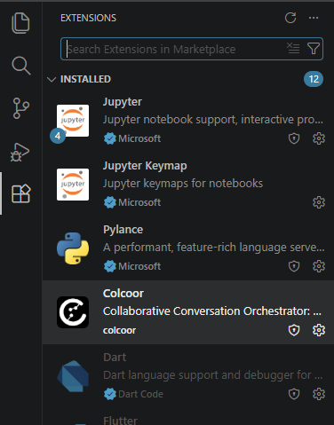
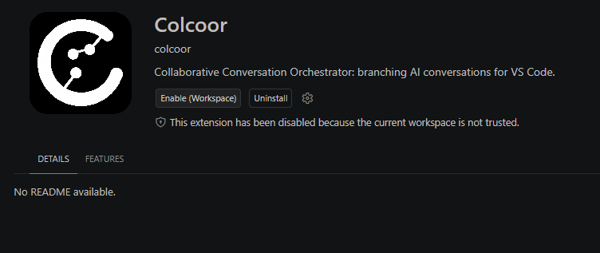
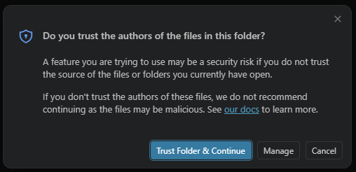
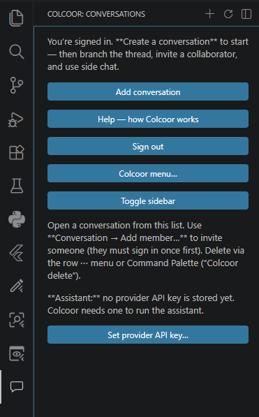
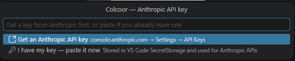
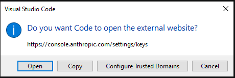
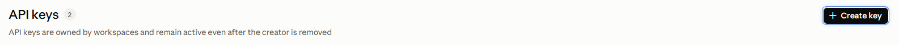
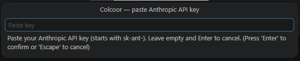
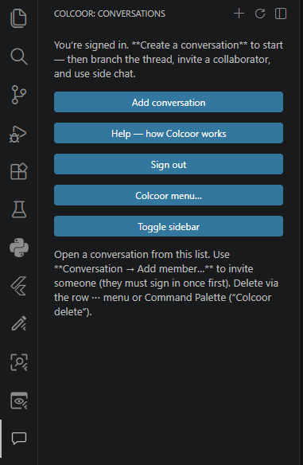
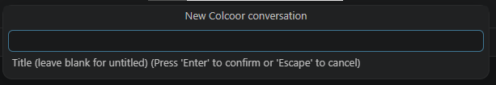

1. Open vs code (or Cursor)
2. Ctrl+Shift+P -> Extensions: install from VSIX
3. Select the .vsix file (e.g. colcoor-extension-0.0.1-win32-x64.vsix)
4. Ctrl+Shift+P -> Preferences: Open Settings (UI)
5. Extensions -> Colcoor -> Storage Mode -> local
6. Ctrl+Shift+P -> Developer: Reload Window
7. 

   

8. Select ‘Enable (Workspace)’

   

9. Select ‘Trust Folder & Continue’

   

10. You will get a new 💬 sign. Select it and then select ‘Set provider API key’

    

11. Select ‘Get an Anthropic API key‘ (or Cursor API key)

    

12. Select ‘Open’

    

13. Select ‘Create key’, follow instructions and copy the key

    

14. Select ‘Set provider API key’

    

15. Select ‘I have my key’

    

16. Paste the copied key

    

17. Select ‘Add conversation’

    

18. Name the conversation

    

19. Start working with Colcoor
