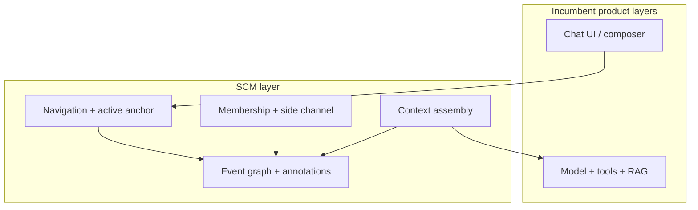

# SCM positioning

*Informative — Structured Conversation Model (SCM) 1.0.0*

---

## The gap

Most LLM products already **branch** conversation history:

- **Edit** a prior user message and continue from an alternate prompt.
- **Regenerate** or **retry** an assistant response.
- **Fork** exploration in research or coding modes.

Those forks are usually **implicit**: list order, hidden siblings, overwritten turns, or session-local state. Users gain alternate outcomes but lose **structure**:

- No stable **identity** per branch point.
- No **map** of alternatives side by side.
- No reliable **“continue from here”** across sessions.
- No **search** across branches, **titles** on nodes, or **team-visible** structure without spamming the model thread.

**Branching capability ≠ branch navigation.**

---

## What SCM is

The **Structured Conversation Model (SCM)** formalizes a layer that incumbent UIs typically omit:

| SCM provides | In one line |
|--------------|-------------|
| **Durable graph** | Main-thread messages are **nodes** with stable IDs and parent edges—not only scrollback order. |
| **Navigation** | Select a node, set an **active anchor**, walk **root → active** for reading and for model context. |
| **Annotations** | **Notes**, **stars**, **display titles**, and a **TODO** convention on messages—not extra tree nodes. |
| **Collaboration** | **Shared workspaces**, **private drafts**, a **side channel**, **references**, and **@mentions** without forking the main graph for every meta comment. |
| **Context assembly** | Deterministic **path + annotations + new turn** as the orchestrator-controlled input to the model. |

SCM is a **missing UX/data abstraction layer**. It sits **under** your existing chat chrome and **beside** your model, tool, and RAG stacks.

---

## Positioning statement

> **Existing LLM UIs already create branches. SCM makes those branches durable, visible, navigable, searchable, referenceable, and collaborative.**

---

## What SCM is not

- **Not** a replacement for your model API, agent framework, or tool protocol.
- **Not** a requirement to remove linear chat—the timeline can remain the default **renderer** of one path.
- **Not** a wire format in v1—conformance is **semantic** (graph invariants, operations, navigation, context assembly).
- **Not** a prescription for composer layout, model picker, attachments, or billing.

Products **MAY** keep every surface users already know. SCM adds **structure and operations** those surfaces can bind to.

---

## Where SCM applies

SCM is relevant wherever humans manage **multi-turn dialogue with alternatives**:

- Consumer and prosumer **chat applications**
- **Coding** and IDE **assistants**
- **Research**, analysis, and knowledge-work environments
- **Enterprise copilots** and shared workspaces
- **Agentic** systems that still expose a human-visible **main thread** (planning, approvals, dialogue)

If the product only ever shows a single immutable transcript with no edit/regenerate semantics, SCM still helps—but the **highest leverage** is products that already fork implicitly.

---

## Interoperability (v1)

SCM v1 interoperability exists at the **semantic and state** level:

- Same **graph invariants** (parent rules, visibility, soft-delete).
- Same **required operations** ([spec/05-operations-and-state-transitions.md](../spec/05-operations-and-state-transitions.md)).
- Same **navigation** and **context assembly** rules where profiles require them.

Two implementations **MAY** use different transports (REST, GraphQL, sync engines, CRDT, WebSocket, proprietary RPC) and still be **SCM-conformant**. Optional REST binding: [reference/transport-rest-profile.md](../reference/transport-rest-profile.md).

---

## Complementary, not competitive

SCM **does not** own model quality, latency, or tool execution. It **does** own how **conversation memory** is stored, shared, and turned into **model input**.

---

## Next documents

| Read next | For |
|-----------|-----|
| [01-executive-summary.md](01-executive-summary.md) | Outcomes and conformance profiles |
| [02-gap-analysis-branching-vs-navigation.md](02-gap-analysis-branching-vs-navigation.md) | Incumbent patterns vs SCM |
| [03-integration-with-existing-products.md](03-integration-with-existing-products.md) | Coexistence and migration |
| [../spec/03-domain-model.md](../spec/03-domain-model.md) | Normative graph semantics |
