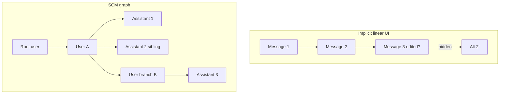

# Branching vs navigation — gap analysis

*Informative — Structured Conversation Model (SCM) 1.0.0*

This document explains why **implicit branching** in incumbent LLM UIs is insufficient, and what **SCM** adds without mandating a particular visual design.

---

## Two different capabilities

| Capability | Question it answers | Typical incumbent support |
|------------|---------------------|---------------------------|
| **Branching** | “Can I get a different continuation from an earlier point?” | Often **yes** (edit message, regenerate) |
| **Branch navigation** | “Where am I in the space of alternatives? Can I name, find, and resume any branch?” | Often **no** or **weak** |

SCM treats **branch navigation** as a **first-class product requirement**, implemented via a **durable graph**, **active anchor**, and **navigation operations** ([spec/03-domain-model.md](../spec/03-domain-model.md), [spec/07-tree-navigation-contract.md](../spec/07-tree-navigation-contract.md)).

---

## Incumbent patterns (generic)

The following describe **common** behavior in consumer chat, coding assistants, and enterprise copilots. No vendor is named; your product may differ in details.

### Pattern A — Linear scrollback with hidden forks

**Behavior:** The UI shows one chronological column. Editing message *N* or regenerating response *N* creates a new continuation, but prior alternatives are **hard to reach** or **discarded**.

| User need | Gap |
|-----------|-----|
| Compare two assistant answers to the same prompt | Must regenerate again or rely on memory |
| Return to branch started yesterday | Often impossible or buried in “history” |
| Share “the path we chose” vs “paths we rejected” | Only the visible linear slice is shareable |

**SCM response:** Each continuation is a **node** with `id` and `parent_event_id`. Siblings are **visible** in the tree (subject to permissions).

### Pattern B — Edit-in-place that erases navigable history

**Behavior:** “Edit” **replaces** the user message text or **truncates** the thread after the edit point without preserving the old node as a peer branch.

| User need | Gap |
|-----------|-----|
| Audit what was asked before the edit | Lost unless logged externally |
| Keep both phrasings as parallel experiments | Not supported |

**SCM response (conformance):** **Append** a new `user_message` (or product-mapped equivalent) as a **child of the branch anchor**; **MUST NOT** delete navigable history for claimed SCM conformance. See [spec/03-domain-model.md](../spec/03-domain-model.md) §9.

### Pattern C — Regenerate without sibling map

**Behavior:** “Try again” produces a new assistant answer; the UI shows **one** answer at a time (carousel, overwrite, or last-wins).

| User need | Gap |
|-----------|-----|
| Label attempts (“draft A”, “draft B”) | Ad hoc |
| Star the best attempt | Not on the graph |
| Build on attempt 2 while keeping attempt 1 | Unclear anchor |

**SCM response:** Multiple `assistant_message` nodes **share** the same parent `user_message` ([spec/03-domain-model.md](../spec/03-domain-model.md) §3.2). **Display titles** and **stars** attach to specific nodes ([spec/09-annotations.md](../spec/09-annotations.md)).

### Pattern D — “Continue from here” without persistent anchor

**Behavior:** User scrolls to an old message and types; the product may or may not include prior context correctly; the **branch point** is not stored as a durable **active anchor**.

| User need | Gap |
|-----------|-----|
| Reload session and resume same branch | Fragile |
| Collaborator continues from same node | Ambiguous |

**SCM response:** Per-user **`active_node_id`** (and optional explicit `parent` on send) in [spec/03-domain-model.md](../spec/03-domain-model.md) §4.

### Pattern E — Collaboration via main thread only

**Behavior:** Teammates paste context into the model thread or use external chat.

| User need | Gap |
|-----------|-----|
| Discuss without changing model context | Pollutes transcript |
| @mention a colleague on a specific message | Informal quoting |
| Private exploration before sharing | No standard private draft |

**SCM response:** **Side channel**, **references**, **private visibility**, **@mentions** ([spec/10-collaboration.md](../spec/10-collaboration.md)).

### Pattern F — Search only in visible linear slice

**Behavior:** Search covers the current transcript window, not all branches or notes.

| User need | Gap |
|-----------|-----|
| Find a TODO left on an old branch | Manual scroll |
| Find text in a discarded regenerate | Often impossible |

**SCM response:** Scoped **in-conversation search** across bodies, titles, notes, side channel ([spec/11-search-and-discovery.md](../spec/11-search-and-discovery.md)).

---

## Visual: implicit list vs explicit graph

In SCM, **U1 → A1** and **U1 → A2** are **siblings**—both navigable. **U2** is a **child of U1** (new user branch), not an erased replacement.

---

## Mapping “edit” and “regenerate” to SCM

| Incumbent action | SCM graph effect |
|------------------|------------------|
| User edits earlier prompt and sends | New **`user_message`** with `parent_event_id` = chosen anchor (typically parent of edited node or edited node per product policy—**policy MUST be documented**) |
| Regenerate assistant | New **`assistant_message`**, same parent **`user_message`** |
| User sends from composer with selection on node X | **`user_message`** child of X (or policy default = `active_node_id`) |
| Private experiment | Subgraph with `visible_to` = caller until **CommitPrivateBranch** |

Normative parent rules: [spec/03-domain-model.md](../spec/03-domain-model.md) §3.

---

## What SCM does not claim to fix

- Model **quality** or **determinism** of outputs.
- **Tool** visualization in the main thread (out of SCM core scope).
- **Global** search across all user conversations (SCM v1 is **per-conversation** search only).
- **Automatic** merge of conflicting branches (human chooses active path).

---

## Summary table

| Dimension | Implicit branching | SCM |
|-----------|-------------------|-----|
| Node identity | Ephemeral or list index | Stable **event id** |
| Structure | List / hidden fork | **Directed graph** |
| Navigation | Scroll | **Tree** (or equivalent) + **selection** |
| Continuation | Fragile | **Active anchor** |
| Alternatives | Last-wins common | **Sibling** nodes visible |
| Meta discussion | Main thread | **Side channel** |
| Private try | Ad hoc | **Private draft** subgraph |
| Discovery | Linear find | **Search**, **stars**, **TODO** notes |
| Model input | Opaque | **Context assembly** from path |

---

## Related

- [00-positioning.md](00-positioning.md)
- [03-integration-with-existing-products.md](03-integration-with-existing-products.md)
- [spec/03-domain-model.md](../spec/03-domain-model.md)
- [spec/07-tree-navigation-contract.md](../spec/07-tree-navigation-contract.md)
