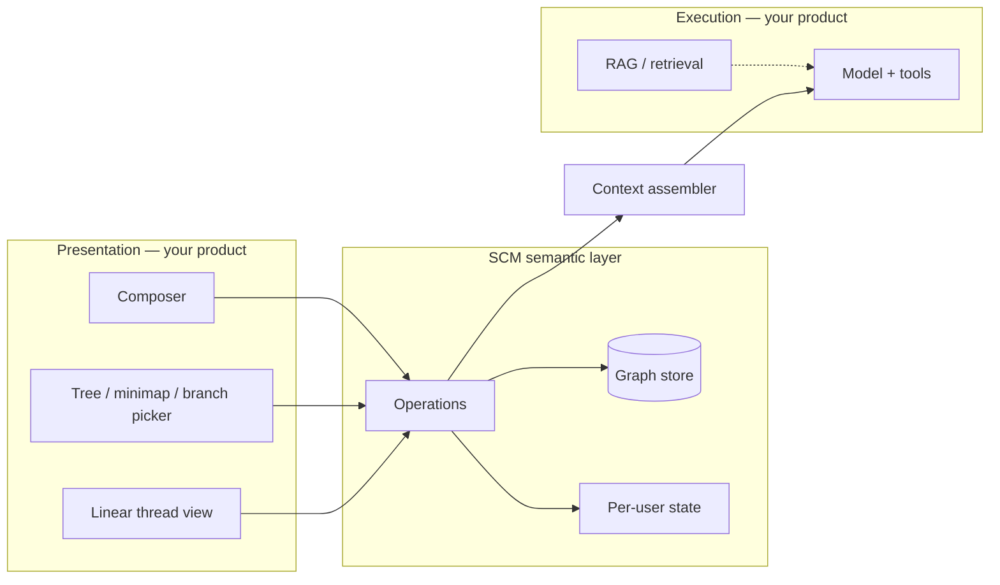

# Integrating SCM with existing products

*Informative — Structured Conversation Model (SCM) 1.0.0*

This document describes how to adopt SCM **alongside** incumbent chat UIs without a disruptive rewrite.

---

## Coexistence model

SCM is a **layer**:

- **Linear thread** MAY remain the default; it renders the path **root → selected node** (or root → active anchor).
- **Tree** (or graph, timeline, branch picker) is the **navigation** surface for the same graph ([spec/07-tree-navigation-contract.md](../spec/07-tree-navigation-contract.md)).
- **Operations** implement [spec/05-operations-and-state-transitions.md](../spec/05-operations-and-state-transitions.md) on your transport of choice.

---

## Concept mapping

Fill this table for your product during design review:

| Your product (examples) | SCM entity | Notes |
|-------------------------|------------|--------|
| Chat / thread / session | **Conversation** | Shared workspace when multi-user |
| Message / turn (user) | **`user_message` event** | Stable `id`; not list index |
| Message / turn (assistant) | **`assistant_message` event** | Siblings = regenerate |
| Edit user message | **Append** new `user_message` (do not erase navigable node) | See [spec/03-domain-model.md](../spec/03-domain-model.md) §9 |
| Regenerate / retry | **Append** `assistant_message` sibling | |
| “Current context” for model | **Path** root → **active_node_id** + notes | [spec/08-context-assembly.md](../spec/08-context-assembly.md) |
| Chat title | **Conversation title** (metadata) | Shared |
| Short label on one message | **Display title** on event | [spec/09-annotations.md](../spec/09-annotations.md) |
| Internal comment on a message | **Note** on `event_id` | Not a tree node |
| Bookmark | **Star** | Per user |
| Team Slack-style thread | **Side channel** | Not in main graph |
| Draft only I can see | **Private** `visible_to` | [spec/10-collaboration.md](../spec/10-collaboration.md) |
| @user in comment | **Mention** in side channel | |
| Link to message #42 | **Reference** (`referenced_event_id`) | |

---

## UI placement options (all conforming)

SCM does **not** mandate a single layout. Examples:

| Pattern | Tree role | Thread role |
|---------|-----------|-------------|
| **Three-column** | Left: tree; center: path + composer; right: side channel | Common in reference implementations |
| **Drawer tree** | Tree slides over thread | Mobile-friendly |
| **Minimap only** | Compact DAG corner | Full-width linear thread |
| **Branch picker modal** | No persistent tree; list children of selected node | Minimal chrome |
| **Breadcrumb-only** | No tree pane; breadcrumb = path | Acceptable for **L2** if jump targets work |

**L2+** requires: select node, show path root→selection, set active anchor, jump from search/star/TODO ([spec/07-tree-navigation-contract.md](../spec/07-tree-navigation-contract.md), [spec/12-ui-capability-checklist.md](../spec/12-ui-capability-checklist.md)).

---

## Transport integration

Your backend **MAY** already expose chat APIs. SCM conformance requires:

1. **Observable state** after each operation matches [spec/05-operations-and-state-transitions.md](../spec/05-operations-and-state-transitions.md).
2. **Graph invariants** in [spec/03-domain-model.md](../spec/03-domain-model.md) hold in storage.

You **MAY**:

- Add SCM tables next to legacy `messages` and sync dual-write.
- Map SCM operations onto existing RPCs with adapter logic.
- Run SCM **client-local** first (local-first profile) and sync later.

Optional REST shapes: [reference/transport-rest-profile.md](../reference/transport-rest-profile.md) — **not** required for SCM v1.

---

## Migration strategies

### 1. Forward-only (greenfield conversations)

New conversations use SCM graph from creation. Legacy threads stay linear-only.

**Pros:** Low risk. **Cons:** Split UX until legacy deprecated.

### 2. Backfill from linear log

Heuristic: each user/assistant pair → chain of events; edit/regenerate markers in export → sibling branches if detectable.

**Pros:** Unified UX. **Cons:** Imperfect history; document confidence to users.

### 3. Dual-write

Every new message writes legacy row **and** SCM event; tree UI reads SCM.

**Pros:** Rollback path. **Cons:** Consistency discipline required.

### 4. Read-only SCM on legacy

Old threads display linear only; SCM features disabled.

**Pros:** Simple. **Cons:** Feature gap on old data.

Pick one strategy per product line and document it in release notes.

---

## Edit-message policy (choose and document)

When the user “edits” message **E**, SCM requires a **documented** mapping. Common choices:

| Policy | Graph effect |
|--------|--------------|
| **Sibling branch** | New `user_message`, `parent_event_id` = `E.parent_event_id` (parallel to `E`) |
| **Child branch** | New `user_message`, `parent_event_id` = `E.id` |
| **Replace (non-conformant)** | Mutate `E.content` in place — **breaks** navigable sibling map; **not** SCM-conformant unless old content preserved as new node |

For SCM conformance, **preserve** the pre-edit node in the graph (hidden or sibling).

---

## Context assembly hook

Before each model call, your orchestrator **MUST**:

1. Resolve **active path** ([spec/08-context-assembly.md](../spec/08-context-assembly.md)).
2. Honor **`needs_context_rebuild`**.
3. Persist **`user_message`** before invocation (ordering invariant).
4. Persist **`assistant_message`** after completion per product policy.

Incumbent “send message” endpoint becomes a thin wrapper over **AppendUserMessage** + model + **AppendAssistantMessage**.

---

## Collaboration rollout

| Phase | Profile | Features |
|-------|---------|----------|
| 1 | L2 | Solo graph + navigation |
| 2 | L3 | Invite members, side channel |
| 3 | L3 | Private drafts + commit |
| 4 | L4 | Search, stars, TODO, titles |

Roles: [spec/06-permissions-and-roles.md](../spec/06-permissions-and-roles.md).

---

## Non-goals for integration projects

- Rewriting tool-call UI in the main thread.
- Replacing your identity provider (SCM assumes **member** records exist).
- Mandating a specific frontend framework.

---

## Verification

Use [reference/conformance-checklist.md](../reference/conformance-checklist.md) per profile. Optional REST tests in [reference/transport-rest-profile.md](../reference/transport-rest-profile.md).

---

## Related

- [02-gap-analysis-branching-vs-navigation.md](02-gap-analysis-branching-vs-navigation.md)
- [spec/05-operations-and-state-transitions.md](../spec/05-operations-and-state-transitions.md)
- [reference/colcoor-mapping.md](../reference/colcoor-mapping.md) — one reference implementation map
