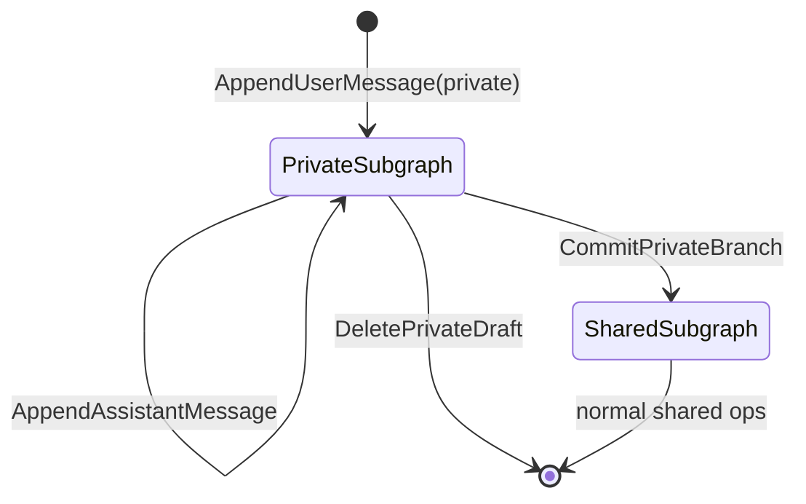

# SCM domain model

**Structured Conversation Model (SCM) 1.0.0 — normative**

Conversation **structure**, **visibility**, **main-thread events**, **per-user state**, and relationships to annotations and side channel. Operations: [05-operations-and-state-transitions.md](05-operations-and-state-transitions.md). Permissions: [06-permissions-and-roles.md](06-permissions-and-roles.md).

---

## 1. Product shape

A **conversation** is a workspace containing:

- A **main-thread graph** of `user_message` and `assistant_message` events,
- **Notes** attached to events (not graph nodes),
- **Per-user** active anchor and context-rebuild flag,
- **Members** with roles (when collaboration is enabled),
- A **side channel** separate from the main graph (L3+).

The **orchestrator** builds **assembled context** from the graph ([08-context-assembly.md](08-context-assembly.md)). Persistence holds events and collaboration data; it **MUST NOT** be the sole implicit transcript in UI memory only.

---

## 2. Conversations and membership

### 2.1 Conversation metadata

| Field | Semantics |
|-------|-----------|
| `id` | Stable identifier |
| `title` | Optional shared display title |
| `created_at`, `updated_at` | Timestamps; `updated_at` reflects structural or content activity |
| `deleted_at` | Optional owner soft-delete of entire conversation |
| `deletion_group_id`, `deleted_by_user_id` | Batch metadata for conversation-level delete |

### 2.2 Membership

Table concept: **`conversation_members`** — one row per `(conversation_id, user_id)`.

| Field | Semantics |
|-------|-----------|
| `role` | `owner` \| `editor` \| `viewer` |
| `pinned` | Per-user sidebar ordering preference |

**Invariants:**

- **Exactly one `owner`** per conversation at all times.
- **Only members** may read or mutate conversation data subject to [06-permissions-and-roles.md](06-permissions-and-roles.md).
- Solo conversations **MAY** have a single member (owner) without invite UI.

### 2.3 Owner delete conversation

**Owner** may soft-delete the **entire** conversation: all live events and the conversation row share one **`deletion_group_id`**, with undo/restore semantics aligned to subtree delete ([05-operations-and-state-transitions.md](05-operations-and-state-transitions.md)).

---

## 3. Main-thread event graph

Stored as **events** (logical name). Core fields:

| Field | Purpose |
|-------|---------|
| `id` | Stable node id |
| `conversation_id` | Owner conversation |
| `parent_event_id` | Parent node; `null` only for root |
| `kind` | `user_message` \| `assistant_message` |
| `actor_type` | `user` \| `assistant` |
| `actor_user_id` | Human author when applicable |
| `content_text` | Primary plain body |
| `content_json` | Optional structured extension |
| `display_title` | Optional short label (see [09-annotations.md](09-annotations.md)) |
| `visible_to` | `null` = shared; user id = private draft for that user |
| `deleted_at` | Soft delete timestamp |
| `deletion_group_id`, `deleted_by_user_id` | Subtree delete batch |
| `created_at`, `updated_at` | Timestamps |

### 3.1 Allowed kinds

The **only** main-thread kinds in SCM v1:

- **`user_message`**
- **`assistant_message`**

Tool calls, system rows, and side-channel kinds **MUST NOT** use main-thread event kinds.

### 3.2 Parent rules

1. **`parent_event_id` is `null`** only for the **single root** `user_message` created at conversation creation.
2. A new **`user_message`** **MUST** reference an existing visible event in the same conversation as parent (branch anchor).
3. A new **`assistant_message`** **MUST** reference the **`user_message`** it answers as parent.
4. **Regenerate / resend:** additional **`assistant_message`** events **share** the same parent **`user_message`** as siblings.

**Forbidden:**

- `assistant_message` as parent of `user_message` (except via product-specific bootstrap not used after root).
- More than one live root per conversation.
- Soft-delete of the live root event.

### 3.3 Shared vs private (`visible_to`)

| `visible_to` | Semantics |
|--------------|-----------|
| `null` | **Shared** — all members see in default tree reads |
| non-null user id | **Private draft** for that user only |

Rules:

- Other members **MUST NOT** see private events in shared tree responses.
- Owning user sees private events when loading tree with private inclusion policy.
- Private **`user_message`** may have child **`assistant_message`** events that remain private until **CommitPrivateBranch**.

### 3.4 Soft delete

When **`deleted_at`** is set on an event:

- That event and **all descendants** are hidden from tree and note-list reads (one operation).
- **Stars** on those events are removed for all users.
- **Notes** on those events no longer appear in list reads.
- **Root** **MUST NOT** be soft-deleted.

**Late append:** appending with parent pointing at a soft-deleted anchor **SHOULD** inherit `deleted_at` on the new row so racing writes stay in the hidden subtree.

**Retention:** implementations **MAY** hard-delete after configurable age (default **14 days** recommended). Before hard delete, repoint **`active_node_id`** to live root for affected users.

**Undo:** deleter may undo within a short window (default **5 minutes**). **Owner/editor** may **restore** later by deletion batch id.

---

## 4. Per-user conversation state

Concept: **`conversation_user_state`** — one row per `(conversation_id, user_id)`.

| Field | Meaning |
|-------|---------|
| `active_node_id` | Branch anchor for next send unless client overrides parent explicitly |
| `needs_context_rebuild` | When true, next send **MUST** rebuild full assembled context ([08-context-assembly.md](08-context-assembly.md)) |
| `last_seen_at` | Collaboration / stale detection |

**Set `needs_context_rebuild = true` when:**

- User changes active anchor or selection policy that alters continuation without sending, or
- A **note** is added, edited, or deleted on any event **visible to that user**.

**Set `needs_context_rebuild = false` when:**

- A **`user_message`** is successfully accepted for that user in that conversation (after context for that send is consumed).

---

## 5. Notes

- Attached to **`event_id`** (host message).
- **Not** tree nodes.
- Ordered by `created_at`, tie-break by `id`.
- Included in assembled context per [08-context-assembly.md](08-context-assembly.md).

---

## 6. Stars

Concept: **`event_stars`** — `(user_id, event_id)`.

Per-user bookmark on a main-thread event. Does not affect graph topology.

---

## 7. Side channel

- **Not** part of the main-thread graph.
- Monotonic **`seq`** per conversation.
- Kinds separate from main-thread (e.g. `user`, `system_join`, `system_leave`).
- Optional references: `referenced_event_id`, `referenced_note_id`, `referenced_side_channel_message_id`.
- Per-user **`last_read_seq`** for unread semantics.

Details: [10-collaboration.md](10-collaboration.md).

---

## 8. Stale graph (collaboration)

When another member mutates the shared graph and a client’s cached tree may be outdated, the client **SHOULD** show a **single** clear refresh prompt rather than silently overwriting local selection.

---

## 9. Mapping incumbent “edit” and “regenerate” behaviors

For **SCM semantic conformance**, products that today **edit** or **overwrite** messages **MUST** map as follows:

| Incumbent action | Required SCM behavior |
|------------------|----------------------|
| Edit prior user text and continue | **Append** new `user_message`; **preserve** prior node in graph (sibling or child per documented policy) |
| Regenerate assistant | **Append** new `assistant_message` sibling under same `user_message` |
| Truncate thread after point X | **MUST NOT** be the only representation; use soft-delete subtree or hide via UI while retaining graph if conformance claimed |

Products **MUST** document their **edit-message parent policy** ([adoption/03-integration-with-existing-products.md](../adoption/03-integration-with-existing-products.md)).

---

## 10. State machine (private draft)

---

## Related

- [04-persistence-schema.md](04-persistence-schema.md)
- [05-operations-and-state-transitions.md](05-operations-and-state-transitions.md)
- [07-tree-navigation-contract.md](07-tree-navigation-contract.md)
- [08-context-assembly.md](08-context-assembly.md)
