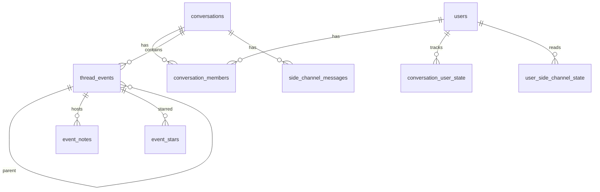

# SCM persistence schema

**Structured Conversation Model (SCM) 1.0.0 — normative logical profile**

This document defines a **reference logical schema** for SCM. Implementations **MAY** use different physical stores (relational, document, embedded, CRDT) if all **invariants** in [03-domain-model.md](03-domain-model.md) are preserved.

PostgreSQL DDL below is a **reference persistence profile**; adapt types to your engine.

---

## 1. Design rules

1. **UUID** primary keys recommended for events and conversations.
2. **Timestamps** in UTC (`timestamptz` or equivalent).
3. **Text** fields normalized to Unix `\n` on write where applicable.
4. **`content_json`** for product extensions; SCM core **MUST NOT** require specific keys for conformance (except where [09-annotations.md](09-annotations.md) defines optional conventions).
5. **Foreign keys** with `ON DELETE CASCADE` from events to dependent notes/stars where hard delete occurs.

---

## 2. Entity relationship (logical)



---

## 3. users

| Column | Type | Purpose |
|--------|------|---------|
| `id` | uuid PK | User |
| `email` | text NOT NULL | Contact / invite |
| `display_name` | text NOT NULL DEFAULT '' | UI label |
| `avatar_url` | text NULL | Avatar |
| `external_subject` | text NOT NULL UNIQUE | Stable id from identity provider |
| `handle` | text NULL UNIQUE | Public @handle for mentions |
| `created_at` | timestamptz NOT NULL | Created |
| `last_login_at` | timestamptz NOT NULL | Last auth |

*Implementations **MAY** name `external_subject` per their IdP (`cursor_sub`, `oidc_sub`, etc.).*

---

## 4. conversations

| Column | Type | Purpose |
|--------|------|---------|
| `id` | uuid PK | Conversation |
| `title` | text NULL | Shared title |
| `created_at` | timestamptz NOT NULL | Created |
| `updated_at` | timestamptz NOT NULL | Last activity |
| `deleted_at` | timestamptz NULL | Owner soft-delete |
| `deletion_group_id` | uuid NULL | Batch id |
| `deleted_by_user_id` | uuid FK NULL | Who deleted |

---

## 5. conversation_members

| Column | Type | Purpose |
|--------|------|---------|
| `conversation_id` | uuid PK FK | Conversation |
| `user_id` | uuid PK FK | Member |
| `role` | text NOT NULL | `owner` \| `editor` \| `viewer` |
| `pinned` | boolean NOT NULL DEFAULT false | Per-user pin |

**Constraints:**

- `CHECK (role IN ('owner','editor','viewer'))`
- **Partial unique index:** at most one `owner` per `conversation_id`:

```sql
CREATE UNIQUE INDEX uq_conversation_single_owner
  ON conversation_members (conversation_id)
  WHERE role = 'owner';
```

---

## 6. thread_events

Logical table name **`thread_events`** (implementations may use `events`).

| Column | Type | Purpose |
|--------|------|---------|
| `id` | uuid PK | Event |
| `conversation_id` | uuid FK NOT NULL | Owner |
| `parent_event_id` | uuid FK NULL | Parent |
| `kind` | text NOT NULL | `user_message` \| `assistant_message` |
| `actor_type` | text NOT NULL | `user` \| `assistant` |
| `actor_user_id` | uuid FK NULL | Human actor |
| `content_text` | text NULL | Body |
| `content_json` | jsonb NULL | Extensions |
| `display_title` | text NULL | Short label ([09-annotations.md](09-annotations.md)) |
| `visible_to` | uuid FK NULL | Private draft owner |
| `deleted_at` | timestamptz NULL | Soft delete |
| `deletion_group_id` | uuid NULL | Subtree batch |
| `deleted_by_user_id` | uuid FK NULL | Who deleted |
| `created_at` | timestamptz NOT NULL | Inserted |
| `updated_at` | timestamptz NOT NULL | Updated |

**Constraints:**

```sql
CHECK (kind IN ('user_message', 'assistant_message'))
```

**Indexes (recommended):**

- `(conversation_id, created_at)`
- `(conversation_id, parent_event_id)`
- `(conversation_id, deleted_at)` partial where `deleted_at IS NULL`

---

## 7. conversation_user_state

| Column | Type | Purpose |
|--------|------|---------|
| `conversation_id` | uuid PK FK | Conversation |
| `user_id` | uuid PK FK | Member |
| `active_node_id` | uuid FK NOT NULL | Active anchor |
| `last_seen_at` | timestamptz NOT NULL | Presence |
| `needs_context_rebuild` | boolean NOT NULL DEFAULT false | Rebuild flag |

---

## 8. event_notes

| Column | Type | Purpose |
|--------|------|---------|
| `id` | uuid PK | Note |
| `event_id` | uuid FK NOT NULL | Host event |
| `author_user_id` | uuid FK NOT NULL | Writer |
| `content` | text NOT NULL | Body |
| `created_at` | timestamptz NOT NULL | Created |
| `updated_at` | timestamptz NOT NULL | Updated |

**Search (L4):** optional GIN/tsvector on `content` per implementation.

---

## 9. event_stars

| Column | Type | Purpose |
|--------|------|---------|
| `user_id` | uuid PK FK | Who starred |
| `event_id` | uuid PK FK | Event |
| `created_at` | timestamptz NOT NULL | When |

---

## 10. side_channel_messages

| Column | Type | Purpose |
|--------|------|---------|
| `id` | uuid PK | Message |
| `conversation_id` | uuid FK NOT NULL | Thread |
| `seq` | int NOT NULL | Monotonic per conversation |
| `kind` | text NOT NULL | `user` \| `system_join` \| `system_leave` (+ extensions) |
| `author_user_id` | uuid FK NULL | Human author |
| `body` | text NULL | Text |
| `referenced_event_id` | uuid FK NULL | Ref |
| `referenced_note_id` | uuid FK NULL | Ref |
| `referenced_side_channel_message_id` | uuid FK NULL | Ref |
| `created_at` | timestamptz NOT NULL | Inserted |
| `updated_at` | timestamptz NOT NULL | Updated |
| `edited_at` | timestamptz NULL | User edit |
| `deleted_at` | timestamptz NULL | Soft delete |
| `deleted_by_user_id` | uuid FK NULL | Moderation |

**Constraints:**

```sql
UNIQUE (conversation_id, seq)
CHECK (kind IN ('user', 'system_join', 'system_leave'))
```

---

## 11. user_side_channel_state

| Column | Type | Purpose |
|--------|------|---------|
| `conversation_id` | uuid PK FK | Conversation |
| `user_id` | uuid PK FK | Reader |
| `last_read_seq` | int NOT NULL DEFAULT 0 | Read cursor |

---

## 12. Optional: conversation_images (binary blobs)

For image attachments referenced from `content_json`:

| Column | Type | Purpose |
|--------|------|---------|
| `id` | uuid PK | Image |
| `conversation_id` | uuid FK | Owner |
| `mime_type` | text | MIME |
| `bytes` | bytea | Payload |
| `created_at` | timestamptz | Upload time |

*Not required for SCM L1–L3.*

---

## 13. Out of scope tables

Billing, subscriptions, and usage metering **MAY** exist in products but are **not** part of SCM v1 core schema.

---

## 14. CRDT / local-first note

CRDT implementations **MUST** converge on:

- Unique event ids,
- Immutable `parent_event_id` after create (except delete/recreate policies documented),
- Monotonic side-channel `seq` per conversation (or equivalent total order).

Conflict resolution for concurrent appends **MUST** be documented; recommended: server authoritative ordering with client retry.

---

## Related

- [03-domain-model.md](03-domain-model.md)
- [05-operations-and-state-transitions.md](05-operations-and-state-transitions.md)
- [reference/transport-rest-profile.md](../reference/transport-rest-profile.md)
