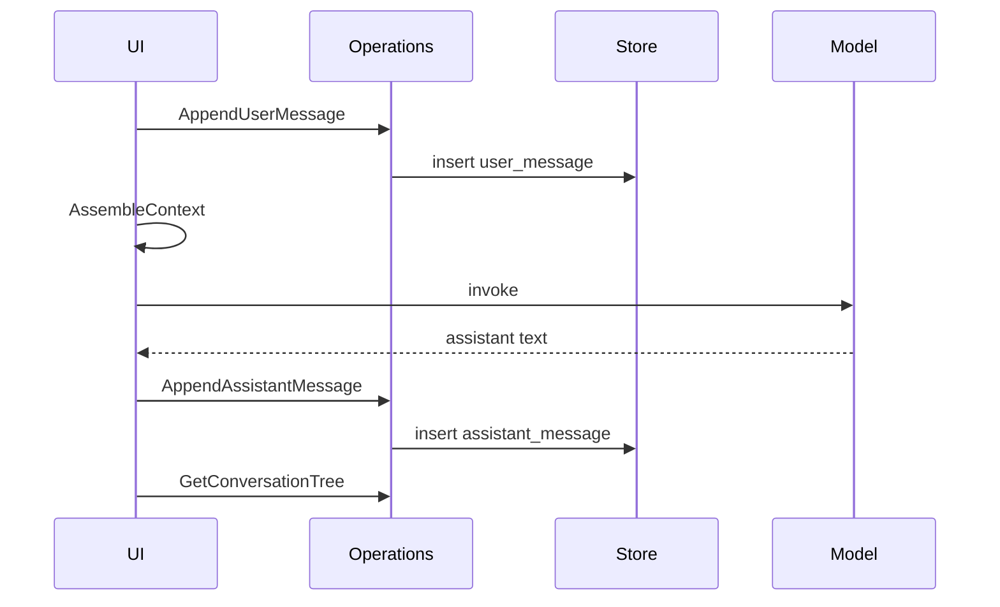

# SCM operations and state transitions

**Structured Conversation Model (SCM) 1.0.0 — normative**

This document defines **required semantic operations** and their **effects**. SCM v1 conformance **MUST** implement these behaviors; binding to HTTP, GraphQL, or local APIs is **optional** ([00-normative-rules.md](00-normative-rules.md)).

Optional REST mapping: [reference/transport-rest-profile.md](../reference/transport-rest-profile.md).

---

## 1. Conventions

### 1.1 Operation entry format

Each operation lists:

- **Id** — stable name (e.g. `AppendUserMessage`)
- **Preconditions** — membership, visibility, role
- **Input** — logical fields
- **Effects** — state changes
- **Errors** — `Forbidden`, `NotFound`, `Invalid`, `Conflict` (map to HTTP in transport profiles)

### 1.2 Authorization

All operations except **Authenticate** (product-defined) require an **authenticated principal** who is a **conversation member**, unless noted. Role checks: [06-permissions-and-roles.md](06-permissions-and-roles.md).

### 1.3 Observable state

After any sequence of operations, a conforming client **MUST** be able to observe:

- **Tree slice** — events visible to caller (shared + own private per policy)
- **Caller state** — `active_node_id`, `needs_context_rebuild`, `last_seen_at`
- **Notes list** on visible events
- **Side channel** messages with `seq > cursor`
- **Starred** flags for caller on visible events

---

## 2. Conversation operations

### 2.1 `CreateConversation`

| | |
|--|--|
| **Preconditions** | Authenticated user |
| **Input** | `title` (optional) |
| **Effects** | Insert conversation; insert caller as **owner**; create **root** `user_message` with `parent_event_id = null`; initialize caller `active_node_id` = root id |
| **Profile** | L1+ |

### 2.2 `ListConversations`

| | |
|--|--|
| **Preconditions** | Authenticated |
| **Input** | — |
| **Effects** | Return conversations where user is member, not conversation-deleted; order: caller `pinned` desc, then `updated_at` desc; include side-channel unread summary if L3+ |
| **Profile** | L1+ |

### 2.3 `UpdateConversation`

| | |
|--|--|
| **Preconditions** | Member; **owner/editor** for `title`; any member for own `pinned` |
| **Input** | `title` (optional), `pinned` (optional, caller-only) |
| **Effects** | Patch allowed fields |
| **Profile** | L1+ |

### 2.4 `DeleteConversation`

| | |
|--|--|
| **Preconditions** | **Owner**; conversation not already deleted |
| **Effects** | Soft-delete all live events + conversation row; assign shared `deletion_group_id`; remove stars on affected events |
| **Returns** | `deleted_count`, `deletion_group_id` |
| **Profile** | L1+ |

### 2.5 `UndoConversationDelete`

| | |
|--|--|
| **Preconditions** | Member; same deleter; within undo window |
| **Input** | `deletion_group_id` |
| **Effects** | Restore all rows in batch |
| **Profile** | L1+ |

### 2.6 `RestoreConversation`

| | |
|--|--|
| **Preconditions** | **Owner or editor**; conversation soft-deleted |
| **Effects** | Clear deletes for conversation batch |
| **Profile** | L1+ |

---

## 3. Membership operations

### 3.1 `ListMembers`

| | |
|--|--|
| **Preconditions** | Member |
| **Effects** | Return `user_id`, `role`, display fields |
| **Profile** | L1+ (multi-user); solo may return single owner |

### 3.2 `SearchInviteCandidates`

| | |
|--|--|
| **Preconditions** | **Owner or editor** |
| **Input** | `query` (id, email, or handle) |
| **Effects** | Return users not already members |
| **Profile** | L3+ |

### 3.3 `AddMember`

| | |
|--|--|
| **Preconditions** | **Owner or editor** |
| **Input** | `user_id`, `role` ∈ {`editor`, `viewer`} |
| **Effects** | Insert membership; optional `system_join` side message |
| **Profile** | L3+ |

### 3.4 `ChangeMemberRole`

| | |
|--|--|
| **Preconditions** | **Owner**; cannot leave zero owners |
| **Input** | `user_id`, `role` |
| **Profile** | L3+ |

### 3.5 `RemoveMember`

| | |
|--|--|
| **Preconditions** | **Owner**; cannot remove sole owner |
| **Input** | `user_id` |
| **Profile** | L3+ |

---

## 4. Graph read operations

### 4.1 `GetConversationTree`

| | |
|--|--|
| **Preconditions** | Member; conversation not deleted (or policy for deleted) |
| **Input** | `include_private_for_caller` (default true for own drafts) |
| **Effects** | Return visible events with: `id`, `parent_event_id`, `kind`, `content_text`, `content_json`, `visible_to`, timestamps, `starred` (caller), `note_count`, `display_title` |
| **Profile** | L1+ |

### 4.2 `GetCallerConversationState`

| | |
|--|--|
| **Preconditions** | Member |
| **Effects** | Return `active_node_id`, `needs_context_rebuild`, `last_seen_at`; if missing, default active = root, rebuild = false |
| **Profile** | L2+ |

---

## 5. Graph mutation operations

### 5.1 `SetActiveAnchor`

| | |
|--|--|
| **Preconditions** | Member; target event visible |
| **Input** | `active_node_id`, `needs_context_rebuild` (optional, default false) |
| **Effects** | Upsert caller state; update `last_seen_at` |
| **Profile** | L2+ |

### 5.2 `AppendUserMessage`

| | |
|--|--|
| **Preconditions** | **Owner/editor** for shared; **any member** for private; parent visible and not deleted; parent rules ([03-domain-model.md](03-domain-model.md) §3.2) |
| **Input** | `parent_event_id`, `content_text`, `private` (boolean), `content_json` (optional), `display_title` (optional) |
| **Effects** | Insert `user_message`; set `visible_to` if private; set caller `needs_context_rebuild = false`; bump `conversation.updated_at` |
| **Returns** | new `event_id` |
| **Profile** | L1+ |

**Ordering invariant (main thread):** **MUST** complete before model invocation for that turn ([08-context-assembly.md](08-context-assembly.md)).

### 5.3 `AppendAssistantMessage`

| | |
|--|--|
| **Preconditions** | Parent is `user_message` visible to caller; same membership rules as graph append |
| **Input** | `parent_event_id` (user message id), `content_text`, `content_json` (optional) |
| **Effects** | Insert `assistant_message` sibling-capable; inherit private visibility from parent if private subtree |
| **Profile** | L1+ |

### 5.4 `SoftDeleteEventSubtree`

| | |
|--|--|
| **Preconditions** | **Owner or editor**; target not root; target visible |
| **Input** | `anchor_event_id` |
| **Effects** | Set `deleted_at` on anchor + descendants; assign `deletion_group_id`; remove stars |
| **Returns** | `deleted_count`, `deletion_group_id` |
| **Profile** | L1+ |

### 5.5 `UndoEventSubtreeDelete`

| | |
|--|--|
| **Preconditions** | Caller is `deleted_by_user_id`; within undo window |
| **Input** | `deletion_group_id` |
| **Effects** | Clear soft-delete for batch |
| **Profile** | L1+ |

### 5.6 `RestoreEventSubtree`

| | |
|--|--|
| **Preconditions** | **Owner or editor** |
| **Input** | `anchor_event_id` with deletion batch |
| **Effects** | Clear soft-delete for all events sharing batch |
| **Profile** | L1+ |

### 5.7 `CommitPrivateBranch`

| | |
|--|--|
| **Preconditions** | **Owner or editor**; anchor in caller’s private subtree |
| **Input** | `anchor_event_id` |
| **Effects** | Set `visible_to = null` on private subtree rooted at anchor |
| **Profile** | L3+ |

### 5.8 `DeletePrivateDraft`

| | |
|--|--|
| **Preconditions** | Caller owns private subtree |
| **Input** | `anchor_event_id` |
| **Effects** | Soft-delete or hard-delete private subtree per product policy |
| **Profile** | L3+ |

### 5.9 `SetEventDisplayTitle`

| | |
|--|--|
| **Preconditions** | **Owner or editor**; event visible |
| **Input** | `event_id`, `display_title` (string or clear) |
| **Effects** | Update `display_title`; set `needs_context_rebuild = true` for all members who can see event (recommended) |
| **Profile** | L4 |

---

## 6. Annotation operations

### 6.1 `ListNotes`

| | |
|--|--|
| **Preconditions** | Member |
| **Effects** | Notes on visible events in conversation |
| **Profile** | L1+ |

### 6.2 `CreateNote`

| | |
|--|--|
| **Preconditions** | **Owner or editor**; host visible |
| **Input** | `event_id`, `content` |
| **Effects** | Insert note; `needs_context_rebuild = true` for members who see host |
| **Profile** | L1+ |

### 6.3 `UpdateNote` / `DeleteNote`

| | |
|--|--|
| **Preconditions** | **Owner or editor** |
| **Effects** | Mutate note; rebuild flag as create |
| **Profile** | L1+ |

### 6.4 `StarEvent` / `UnstarEvent`

| | |
|--|--|
| **Preconditions** | Any member; event visible |
| **Effects** | Insert/delete `event_stars` row for caller |
| **Profile** | L4 |

---

## 7. Side channel operations

### 7.1 `ListSideChannelMessages`

| | |
|--|--|
| **Preconditions** | Member |
| **Input** | `after_seq` (default 0) |
| **Effects** | Messages with `seq > after_seq` ascending; include tombstones if soft-deleted |
| **Profile** | L3+ |

### 7.2 `SendSideChannelMessage`

| | |
|--|--|
| **Preconditions** | Member |
| **Input** | `body`, optional references, optional mention metadata |
| **Effects** | Insert `kind=user` with next `seq`; bump conversation activity |
| **Profile** | L3+ |

### 7.3 `EditSideChannelMessage`

| | |
|--|--|
| **Preconditions** | **Own** user message |
| **Input** | `message_id`, `body` |
| **Profile** | L3+ |

### 7.4 `DeleteSideChannelMessage`

| | |
|--|--|
| **Preconditions** | **Owner** (any) or **own** message (editor/viewer) |
| **Profile** | L3+ |

### 7.5 `SetSideChannelReadCursor`

| | |
|--|--|
| **Preconditions** | Member |
| **Input** | `last_read_seq` |
| **Effects** | Upsert read state |
| **Profile** | L3+ |

### 7.6 `SubscribeSideChannelUpdates`

| | |
|--|--|
| **Preconditions** | Member |
| **Effects** | Stream or poll new messages / edits / deletes after cursor |
| **Transport** | Implementation-defined (SSE, WebSocket, push) |
| **Profile** | L3+ |

---

## 8. Search operations

### 8.1 `SearchConversation`

| | |
|--|--|
| **Preconditions** | Member |
| **Input** | `query`, `scopes[]` ⊆ {`main_bodies`, `message_titles`, `notes`, `side_channel`} |
| **Effects** | Return ordered hits ([11-search-and-discovery.md](11-search-and-discovery.md)) |
| **Implementation** | Client-side scan or server index |
| **Profile** | L4 |

---

## 9. State machines

### 9.1 Main-thread send (happy path)

### 9.2 Regenerate (resend)

1. `SetActiveAnchor` → target `user_message` (optional)
2. Assemble context **root → that user_message only** (exclude prior assistant siblings)
3. Invoke model
4. `AppendAssistantMessage` with same parent

No new `AppendUserMessage`.

---

## 10. Concurrency

| Scenario | Recommended behavior |
|----------|------------------------|
| Two members append shared branches | Both succeed; tree has two children; stale prompt for other client |
| Same member double-send | Serialize per conversation or use idempotency keys |
| Delete while other composes | Composer validates parent still live on send |

---

## 11. Error catalog (semantic)

| Code | Meaning |
|------|---------|
| `Forbidden` | Role or visibility denies operation |
| `NotFound` | Conversation, event, or member absent (or hidden) |
| `Invalid` | Parent rule violation, empty body where disallowed, etc. |
| `Conflict` | Duplicate membership, seq collision |
| `Gone` | Undo window expired |

Products **MAY** map `NotFound` instead of `Forbidden` for non-members to avoid enumeration.

---

## Related

- [06-permissions-and-roles.md](06-permissions-and-roles.md)
- [08-context-assembly.md](08-context-assembly.md)
- [reference/transport-rest-profile.md](../reference/transport-rest-profile.md)
